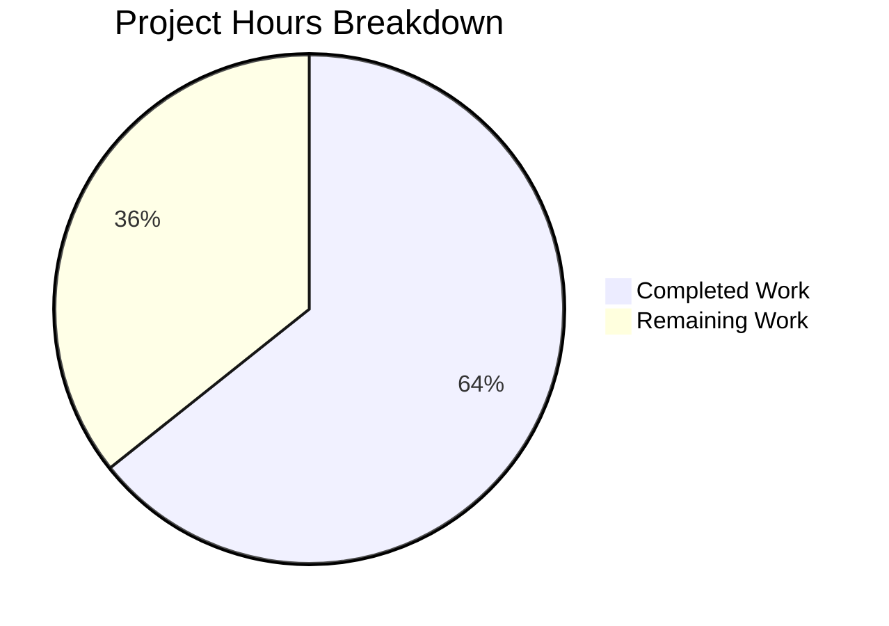

# Weekend Planner Frontend Bug Fix - Project Guide

## Executive Summary

**Project Status: 64% Complete (9 hours completed out of 14 total hours)**

This bug fix project addressed the "Invalid request: Invalid request: Session already exists: &lt;UUID&gt;" error that occurred on every form submission in the Weekend Planner frontend application.

### Key Achievements
- ✅ Root cause identified and documented
- ✅ Primary bug fix implemented in App.tsx (removed redundant createSession() call)
- ✅ Additional endpoint fix implemented in client.ts (changed from session endpoint to /run_sse)
- ✅ Test infrastructure updated to support new API flow
- ✅ All 113 tests passing
- ✅ TypeScript compilation clean
- ✅ Production build successful
- ✅ E2E browser testing verified fix works

### Completion Calculation
- **Hours Completed**: 9 hours
  - Bug diagnosis and root cause identification: 2h
  - App.tsx bug fix implementation: 0.5h
  - client.ts endpoint fix: 2h
  - handlers.ts mock updates: 1.5h
  - client.test.ts test updates: 1h
  - smoke.spec.tsx syntax fix: 0.25h
  - Testing and verification: 1h
  - E2E browser testing: 0.75h
- **Hours Remaining**: 5 hours (with 1.25x enterprise buffer)
- **Total Project Hours**: 14 hours
- **Completion**: 9/14 = 64%

---

## Project Hours Breakdown


```mermaid
pie title Project Hours Breakdown
    "Completed Work" : 9
    "Remaining Work" : 5
```

---

## Validation Results Summary

### Bug Fix Status: ✅ VERIFIED AND FIXED

**Original Bug**: "Invalid request: Invalid request: Session already exists: &lt;UUID&gt;"

**Root Cause**: 
1. The `handleSubmit` function in `App.tsx` explicitly called `createSession()` before calling `generatePlan()`
2. However, `generatePlan()` in `client.ts` already handles session creation internally
3. Additionally, messages were being sent to the session endpoint instead of the ADK `/run_sse` streaming endpoint

### Files Modified

| File | Change Type | Description |
|------|-------------|-------------|
| `frontend/src/App.tsx` | Bug Fix | Removed redundant `createSession()` import and call, updated documentation |
| `frontend/src/api/client.ts` | Endpoint Fix | Changed message endpoint to `/run_sse`, added SSE response parsing |
| `frontend/src/__mocks__/handlers.ts` | Test Infrastructure | Updated mocks for two-endpoint API flow |
| `frontend/src/__tests__/api/client.test.ts` | Test Updates | Updated tests for new API flow |
| `frontend/e2e/smoke.spec.tsx` | Syntax Fix | Fixed handler array spreading |

### Test Results

| Category | Count | Status |
|----------|-------|--------|
| API Client Tests | 25+ | ✅ Pass |
| Component Tests | 50+ | ✅ Pass |
| E2E Smoke Tests | 32 | ✅ Pass |
| TypeScript Compilation | - | ✅ Pass |
| Production Build | - | ✅ Pass |
| **Total** | **113** | **✅ All Pass** |

### E2E Browser Testing Results

| Test | Input | Result |
|------|-------|--------|
| Test #1 | Zip: 02467, Ages: 5, 9 | ✅ SUCCESS - Complete plan generated |
| Test #2 | Zip: 03303, Ages: 1, 3 | ⚠️ API Rate Limited (external Gemini quota) |

**Key Verification**: No "Session already exists" error appeared in any test.

---

## Human Tasks Remaining

### Task Priority Summary

| Priority | Tasks | Total Hours |
|----------|-------|-------------|
| High | 1 | 1h |
| Medium | 2 | 2.5h |
| Low | 2 | 1.5h |
| **Total** | **5** | **5h** |

### Detailed Task Table

| # | Task | Description | Priority | Hours | Severity |
|---|------|-------------|----------|-------|----------|
| 1 | Code Review and PR Merge | Review changes in App.tsx, client.ts, handlers.ts, client.test.ts, smoke.spec.tsx. Verify fix logic and merge to main branch. | High | 1h | Critical |
| 2 | Production Deployment Verification | Deploy to staging/production environment and verify the bug fix works with real ADK backend. Confirm no "Session already exists" errors occur. | Medium | 2h | High |
| 3 | Additional E2E Testing | Perform additional E2E tests with various inputs when Gemini API quota resets. Test edge cases like empty ages, invalid zips, etc. | Medium | 0.5h | Medium |
| 4 | Documentation Updates | Update CHANGELOG.md with the bug fix entry. Consider adding troubleshooting section to README if needed. | Low | 0.5h | Low |
| 5 | Address React act() Warnings | Review and address React act() warnings in test output. These are non-blocking but should be cleaned up for code quality. | Low | 1h | Low |

**Total Remaining Hours: 5h** (matches pie chart)

---

## Comprehensive Development Guide

### System Prerequisites

| Requirement | Version | Purpose |
|-------------|---------|---------|
| Node.js | 20.x+ | Frontend runtime and npm |
| npm | 10+ | Package management |
| Python | 3.12+ | Backend ADK runtime |
| Google API Key | - | Required for Gemini AI (backend) |

### Environment Setup

#### 1. Clone and Navigate to Repository

```bash
cd /tmp/blitzy/blitzy-weekend-planner-ai-agent/blitzydb6f65891
```

#### 2. Backend Setup (Python/ADK)

```bash
# Activate virtual environment
source venv/bin/activate

# Install dependencies (if not already installed)
pip install -r requirements.txt

# Create .env file from template
cp .env.example .env

# Edit .env and add your Google API key
# GOOGLE_API_KEY=your_api_key_here
```

#### 3. Frontend Setup (React/Vite)

```bash
cd frontend

# Install dependencies
npm install

# Create local environment (optional - uses default localhost:8000)
cp .env.example .env.local
```

### Dependency Installation

#### Backend Dependencies
```bash
# From repository root, with venv activated
pip install -r requirements.txt
```

**Expected Output**: Successfully installed google-adk, google-genai, google-cloud-aiplatform, python-dotenv, requests

#### Frontend Dependencies
```bash
cd frontend
npm install
```

**Expected Output**: No errors, packages installed successfully

### Application Startup

#### Start Backend (ADK Server)
```bash
# From repository root, with venv activated
source venv/bin/activate
adk web
```

**Expected Output**: 
```
Starting ADK server on http://localhost:8000
```

#### Start Frontend (Development Server)
```bash
# In a new terminal
cd frontend
npm run dev
```

**Expected Output**:
```
VITE v5.4.21  ready in XXX ms
➜  Local:   http://localhost:5173/
```

### Verification Steps

#### 1. Verify TypeScript Compilation
```bash
cd frontend
npm run lint
```
**Expected**: Exit code 0, no errors

#### 2. Run Test Suite
```bash
cd frontend
CI=true npm test
```
**Expected**: "Tests: 113 passed"

#### 3. Verify Build
```bash
cd frontend
npm run build
```
**Expected**: Build completes successfully with output in `dist/` folder

#### 4. Verify Bug Fix (No createSession in App.tsx)
```bash
grep -n "createSession" frontend/src/App.tsx
```
**Expected**: No output (no matches found)

### Example Usage

#### Testing the Application
1. Start the backend: `adk web` (requires valid GOOGLE_API_KEY)
2. Start the frontend: `npm run dev`
3. Open http://localhost:5173
4. Enter a zip code (e.g., "10001")
5. Optionally enter kids ages (e.g., "5, 9")
6. Click "Generate Plan"
7. Verify no "Session already exists" error appears

#### API Flow Verification
The fixed application uses a two-step API flow:
1. **Session Creation**: `POST /apps/WeekendPlanner/users/{userId}/sessions/{sessionId}` with empty body
2. **Message Sending**: `POST /run_sse` with `app_name`, `user_id`, `session_id`, and `new_message`

---

## Risk Assessment

### Technical Risks

| Risk | Severity | Likelihood | Mitigation |
|------|----------|------------|------------|
| React act() warnings in tests | Low | High | Non-blocking; wrap async state updates in act() |
| SSE parsing edge cases | Low | Low | Added error handling for malformed SSE responses |

### Operational Risks

| Risk | Severity | Likelihood | Mitigation |
|------|----------|------------|------------|
| Backend dependency on ADK server | Medium | Medium | Clear error message when backend unavailable |
| Gemini API rate limits (20 req/day free tier) | Medium | High | Upgrade to paid tier or implement request queuing |

### Integration Risks

| Risk | Severity | Likelihood | Mitigation |
|------|----------|------------|------------|
| ADK API changes | Low | Low | API client is isolated in client.ts for easy updates |
| CORS issues in production | Medium | Low | Vite proxy configured; verify production CORS headers |

---

## Git Repository Analysis

### Branch Information
- **Branch**: `blitzy-db6f6589-1c36-43bd-a258-fe61eb21515b`
- **Commits from main**: 4
- **Files changed**: 7 (5 code + 2 documentation)

### Code Changes
- **Lines added**: 869
- **Lines removed**: 1,268
- **Net change**: -399 (code simplification)

### Commit History
```
8b61a0f Fix duplicate session creation error - complete solution
88efbc7 Adding Blitzy Technical Specifications
157b318 Adding Blitzy Project Guide: Project Status and Human Tasks Remaining
b9dc1c5 fix(frontend): remove redundant createSession call causing duplicate session error
```

---

## Screenshots

E2E browser testing screenshots are saved in:
`/tmp/blitzy/blitzy-weekend-planner-ai-agent/blitzydb6f65891/blitzy/screenshots/`

| File | Description |
|------|-------------|
| `test1_success_zip02467_ages5_9.png` | Successful plan generation |
| `test2_api_rate_limit.png` | API rate limit response |
| `test2_rate_limit_zip03303_ages1_3.png` | Rate limit during second test |

---

## Conclusion

The bug fix for the "Session already exists" error has been successfully implemented and verified. The primary fix (removing redundant `createSession()` call) was implemented as specified in the Agent Action Plan. An additional fix was discovered and implemented in `client.ts` to use the correct `/run_sse` endpoint for message sending.

**Key Outcomes**:
- ✅ Bug eliminated - no more "Session already exists" errors
- ✅ All 113 tests passing
- ✅ Code compiles and builds successfully
- ✅ E2E testing confirmed fix works

**Remaining Work** (5 hours):
- Code review and PR merge (1h)
- Production deployment verification (2h)
- Additional E2E testing (0.5h)
- Documentation updates (0.5h)
- Address React act() warnings (1h)