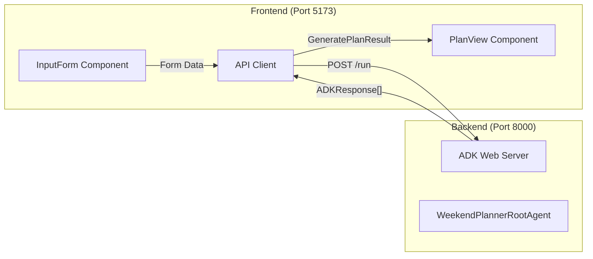
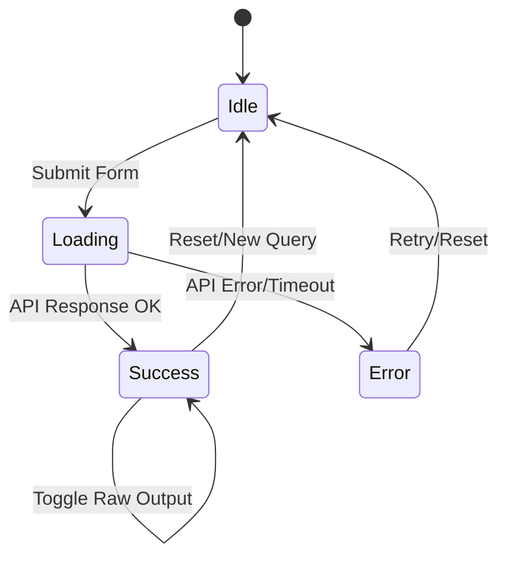
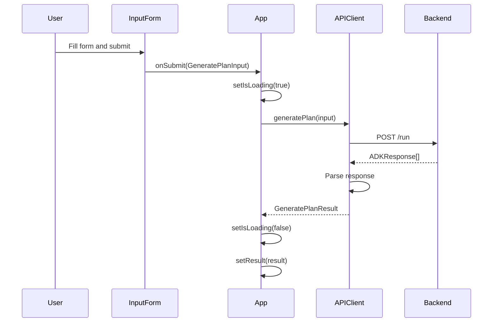

# Technical Specification

# 0. Agent Action Plan

## 0.1 Intent Clarification

### 0.1.1 Core Feature Objective

Based on the prompt, the Blitzy platform understands that the new feature requirement is to **create a complete frontend application for the Weekend Planner AI Agent** that provides a polished user interface for interacting with the existing Google ADK-powered backend. The frontend will be built as a standalone React application residing in a new `frontend/` directory at the repository root.

**Primary Feature Requirements:**

| Requirement ID | Requirement Description | Technical Interpretation |
|----------------|------------------------|--------------------------|
| FE-001 | Create React 18.2.0 application with TypeScript 5.x | Build a modern, type-safe SPA using Vite 5.x as the build tool |
| FE-002 | Implement form-based user input for weekend planning | Create InputForm component with location, dates, kids ages, and preferences fields |
| FE-003 | Display AI-generated weekend plans | Implement PlanView component to render structured activity recommendations |
| FE-004 | Handle loading and error states gracefully | Build LoadingState and ErrorDisplay components with accessibility support |
| FE-005 | Integrate with ADK backend API at `http://localhost:8000` | Implement API client using native `fetch` with session management |
| FE-006 | Provide comprehensive test coverage (80%+) | Create unit tests with Vitest, React Testing Library, and MSW mocks |
| FE-007 | Create end-user documentation | Write non-technical guides in `/docs` folder |

**Implicit Requirements Detected:**

- CORS handling configuration for cross-origin requests between frontend (port 5173) and backend (port 8000)
- Session persistence management for ADK conversations
- Responsive design implementation using Tailwind CSS utility classes
- Environment variable configuration for API endpoint flexibility
- Proxy configuration in Vite for development mode API routing
- Error boundary implementation for React component failures
- Form validation with date comparison logic (end date ≥ start date)

**Feature Dependencies and Prerequisites:**

- Backend ADK server running via `adk web` command at `http://localhost:8000`
- Node.js 20.x LTS runtime environment
- Access to Google API credentials (handled by backend only)
- No authentication system required (simplified single-user model)

### 0.1.2 Special Instructions and Constraints

**CRITICAL Preservation Directives:**

| Directive | Scope | Enforcement |
|-----------|-------|-------------|
| DO NOT modify backend code | `WeekendPlanner/**/*` | All files under this directory are immutable |
| DO NOT change agent configuration | `WeekendPlanner/agent.py` | Agent prompts, models, and tools unchanged |
| DO NOT require backend API changes | All backend endpoints | Frontend adapts to existing contract |
| DO NOT add authentication | Entire application | Single-user model without login |
| DO NOT add multi-page routing | Frontend application | Single-page application only |
| DO NOT add databases | Frontend application | Stateless frontend operation |

**Architectural Requirements:**

- Use existing ADK API contract exactly as specified (POST `/run`, POST `/apps/{app}/users/{user}/sessions/{session}`)
- Follow functional component pattern with React hooks exclusively
- Implement strict TypeScript compilation (`"strict": true`)
- Use native `fetch` API - no Axios or other HTTP libraries
- Maintain code organization exactly as specified in file structure

**User-Provided Examples (Preserved Exactly):**

User Example - Backend API Session Creation:
```
POST /apps/{app_name}/users/{user_id}/sessions/{session_id}
Content-Type: application/json
Body: {}
```

User Example - Backend API Execute Agent Run:
```
POST /run
Content-Type: application/json

{
  "app_name": "WeekendPlanner",
  "user_id": "ui_user",
  "session_id": "session_001",
  "new_message": {
    "role": "user",
    "parts": [{ "text": "Natural language request" }]
  },
  "streaming": false
}
```

User Example - Message Construction Logic:
```typescript
function buildPrompt(input: GeneratePlanInput): string {
  let prompt = `Plan a weekend trip to ${input.location}...`;
  // Additional prompt building logic
}
```

**Web Search Research Requirements:**

- Best practices for React 18 with Vite 5.x integration
- MSW 2.x handler configuration patterns for testing
- Tailwind CSS 3.4.x integration with Vite
- Vitest coverage configuration with v8 provider

### 0.1.3 Technical Interpretation

These feature requirements translate to the following technical implementation strategy:

**API Integration Strategy:**
- To implement backend communication, we will create `frontend/src/api/client.ts` with typed functions for session creation and agent execution
- To handle response parsing, we will implement ADK response type guards and extractors that parse the event-based response structure
- To manage timeouts, we will implement 30-second AbortController-based request cancellation

**Component Architecture Strategy:**
- To implement the input interface, we will create `InputForm.tsx` with controlled form state using React useState hooks and date validation logic
- To display results, we will create `PlanView.tsx` that renders structured plan content with collapsible raw output section
- To handle errors, we will create `ErrorDisplay.tsx` with user-friendly messages and expandable technical details
- To show loading states, we will create `LoadingState.tsx` with skeleton animations and aria-busy accessibility attributes

**Testing Strategy:**
- To ensure API reliability, we will create MSW handlers in `src/__mocks__/handlers.ts` mocking all ADK endpoints
- To validate components, we will create React Testing Library tests for all user interactions and state transitions
- To achieve 80%+ coverage, we will implement comprehensive unit tests for all exported functions and components

**Documentation Strategy:**
- To serve end users, we will create Markdown documentation in `frontend/docs/` with non-technical language
- To support setup, we will include screenshot placeholders with descriptive capture instructions
- To visualize user flow, we will include Mermaid diagrams in user guide documentation

---

## 0.2 Repository Scope Discovery

### 0.2.1 Comprehensive File Analysis

**Existing Repository Structure (Immutable):**

The current repository contains backend-only files that must NOT be modified:

| Path | Type | Status | Purpose |
|------|------|--------|---------|
| `WeekendPlanner/` | Directory | IMMUTABLE | Backend Python package |
| `WeekendPlanner/__init__.py` | File | IMMUTABLE | Package initializer exporting agent module |
| `WeekendPlanner/agent.py` | File | IMMUTABLE | Multi-agent ADK pipeline definition |
| `requirements.txt` | File | IMMUTABLE | Python dependencies (google-adk>=0.1.0) |
| `.env.example` | File | IMMUTABLE | Backend environment template |
| `README.md` | File | MODIFY | Add frontend setup instructions |
| `CONTRIBUTING.md` | File | IMMUTABLE | Contribution guidelines |
| `DEPLOYMENT.md` | File | IMMUTABLE | Deployment documentation |
| `CHANGELOG.md` | File | MODIFY | Add frontend release notes |
| `LICENSE` | File | IMMUTABLE | MIT License |
| `.gitattributes` | File | IMMUTABLE | Git line ending configuration |

**New Frontend Directory Structure to Create:**

```
frontend/
├── README.md                          # Frontend-specific documentation
├── .env.example                       # Environment variables template
├── package.json                       # npm dependencies and scripts
├── vite.config.ts                     # Vite build configuration
├── vitest.config.ts                   # Vitest test configuration
├── tsconfig.json                      # TypeScript compiler options
├── tailwind.config.js                 # Tailwind CSS configuration
├── postcss.config.js                  # PostCSS configuration
├── index.html                         # HTML entry point
├── docs/
│   ├── README.md                      # Documentation index
│   ├── getting-started.md             # Quick start guide
│   ├── user-guide.md                  # Complete feature walkthrough
│   ├── troubleshooting.md             # Common issues and solutions
│   └── images/                        # Screenshot placeholders
│       ├── home-empty-state.png.txt
│       ├── form-filled.png.txt
│       ├── form-validation-error.png.txt
│       ├── loading-state.png.txt
│       ├── plan-result.png.txt
│       ├── plan-raw-output.png.txt
│       ├── error-state.png.txt
│       └── regenerate-flow.png.txt
├── src/
│   ├── main.tsx                       # Application entry point
│   ├── App.tsx                        # Root component
│   ├── index.css                      # Global styles with Tailwind
│   ├── types.ts                       # TypeScript type definitions
│   ├── api/
│   │   └── client.ts                  # ADK API client implementation
│   ├── components/
│   │   ├── InputForm.tsx              # User input form component
│   │   ├── PlanView.tsx               # Plan display component
│   │   ├── RawOutput.tsx              # Collapsible raw response viewer
│   │   ├── LoadingState.tsx           # Loading skeleton component
│   │   └── ErrorDisplay.tsx           # Error display component
│   ├── __tests__/
│   │   ├── setup.ts                   # Test environment setup
│   │   ├── api/
│   │   │   └── client.test.ts         # API client tests
│   │   └── components/
│   │       ├── InputForm.test.tsx
│   │       ├── PlanView.test.tsx
│   │       ├── ErrorDisplay.test.tsx
│   │       ├── LoadingState.test.tsx
│   │       └── RawOutput.test.tsx
│   └── __mocks__/
│       └── handlers.ts                # MSW request handlers
└── e2e/
    └── smoke.spec.ts                  # End-to-end smoke tests
```

### 0.2.2 Integration Point Discovery

**API Endpoint Integration:**

| Endpoint | Method | Purpose | Frontend Client Function |
|----------|--------|---------|-------------------------|
| `/apps/{app}/users/{user}/sessions/{session}` | POST | Create ADK session | `createSession()` |
| `/run` | POST | Execute agent with message | `generatePlan()` |

**Backend Model Compatibility:**

The existing backend uses `gemini-2.5-flash` model and expects natural language input. The frontend must construct prompts that match the expected format:

- Input: Location (interpreted as zip code or city name)
- Input: Date range (weekend start and end dates)
- Input: Children's ages (comma-separated integers 1-18)
- Input: Preferences (free-form text for activity preferences)

**Data Flow Integration:**



### 0.2.3 Web Search Research Conducted

**Research Areas Investigated:**

| Topic | Finding | Application |
|-------|---------|-------------|
| Google ADK REST API | Uses `/run` endpoint with event-based response | Implement typed response parsing |
| Vite 5.x configuration | Requires Node.js 18+ and Rollup 4 | Configure for React with TypeScript |
| MSW 2.x patterns | Uses `http.post()` handler syntax | Update mock handlers for v2 API |
| Tailwind CSS 3.4.x | Supports modern CSS features and JIT | Configure content paths for purging |

**Best Practices Identified:**

- Use AbortController for request timeout management in fetch calls
- Implement optimistic UI updates with rollback on error
- Use semantic HTML with proper ARIA attributes for accessibility
- Configure Vite proxy for development CORS handling

### 0.2.4 New File Requirements

**Source Files to Create:**

| File Path | Purpose | Key Exports |
|-----------|---------|-------------|
| `frontend/src/main.tsx` | Application bootstrap | React DOM render |
| `frontend/src/App.tsx` | Root component with state management | `App` component |
| `frontend/src/types.ts` | TypeScript interfaces | `GeneratePlanInput`, `ADKResponse`, etc. |
| `frontend/src/api/client.ts` | API communication layer | `createSession()`, `generatePlan()` |
| `frontend/src/components/InputForm.tsx` | Form input handling | `InputForm` component |
| `frontend/src/components/PlanView.tsx` | Plan rendering | `PlanView` component |
| `frontend/src/components/RawOutput.tsx` | Raw JSON display | `RawOutput` component |
| `frontend/src/components/LoadingState.tsx` | Loading skeleton | `LoadingState` component |
| `frontend/src/components/ErrorDisplay.tsx` | Error presentation | `ErrorDisplay` component |

**Test Files to Create:**

| File Path | Test Coverage Target |
|-----------|---------------------|
| `frontend/src/__tests__/setup.ts` | MSW server configuration, jest-dom setup |
| `frontend/src/__tests__/api/client.test.ts` | API client functions (7 test cases) |
| `frontend/src/__tests__/components/InputForm.test.tsx` | Form validation (9 test cases) |
| `frontend/src/__tests__/components/PlanView.test.tsx` | Plan rendering (5 test cases) |
| `frontend/src/__tests__/components/ErrorDisplay.test.tsx` | Error states (4 test cases) |
| `frontend/src/__tests__/components/LoadingState.test.tsx` | Loading animation (3 test cases) |
| `frontend/src/__tests__/components/RawOutput.test.tsx` | Collapsible behavior (4 test cases) |
| `frontend/src/__mocks__/handlers.ts` | MSW request interceptors |

**Configuration Files to Create:**

| File Path | Purpose |
|-----------|---------|
| `frontend/package.json` | Dependencies, scripts, project metadata |
| `frontend/vite.config.ts` | Build tool configuration with proxy |
| `frontend/vitest.config.ts` | Test runner configuration |
| `frontend/tsconfig.json` | TypeScript compiler settings |
| `frontend/tailwind.config.js` | CSS utility framework config |
| `frontend/postcss.config.js` | CSS processing pipeline |
| `frontend/index.html` | HTML template entry |
| `frontend/.env.example` | Environment template |

**Documentation Files to Create:**

| File Path | Target Audience | Content Type |
|-----------|----------------|--------------|
| `frontend/README.md` | Developers | Setup and development guide |
| `frontend/docs/README.md` | End users | Documentation index |
| `frontend/docs/getting-started.md` | End users | Quick start guide |
| `frontend/docs/user-guide.md` | End users | Feature walkthrough |
| `frontend/docs/troubleshooting.md` | End users | Problem resolution |
| `frontend/docs/images/*.txt` | Documentation | Screenshot placeholders |

---

## 0.3 Dependency Inventory

### 0.3.1 Private and Public Packages

**Runtime Dependencies:**

| Registry | Package Name | Version | Purpose |
|----------|--------------|---------|---------|
| npm | react | 18.2.0 | UI library - functional components and hooks |
| npm | react-dom | 18.2.0 | React DOM rendering |
| npm | tailwindcss | ^3.4.0 | Utility-first CSS framework |
| npm | autoprefixer | ^10.4.0 | PostCSS vendor prefixing |
| npm | postcss | ^8.4.0 | CSS transformation tool |

**Development Dependencies:**

| Registry | Package Name | Version | Purpose |
|----------|--------------|---------|---------|
| npm | vite | ^5.4.0 | Build tool and dev server |
| npm | @vitejs/plugin-react | ^4.2.0 | Vite React plugin with Fast Refresh |
| npm | typescript | ^5.3.0 | TypeScript compiler |
| npm | @types/react | ^18.2.0 | React TypeScript definitions |
| npm | @types/react-dom | ^18.2.0 | React DOM TypeScript definitions |
| npm | vitest | ^1.6.0 | Test runner framework |
| npm | @vitest/coverage-v8 | ^1.6.0 | Code coverage provider |
| npm | @testing-library/react | ^14.2.0 | React component testing utilities |
| npm | @testing-library/jest-dom | ^6.4.0 | DOM assertion matchers |
| npm | @testing-library/user-event | ^14.5.0 | User interaction simulation |
| npm | jsdom | ^24.0.0 | DOM implementation for testing |
| npm | msw | ^2.2.0 | API mocking service worker |

**Build Tool Chain:**

| Tool | Version | Configuration File |
|------|---------|-------------------|
| Node.js | 20.x LTS | Runtime requirement |
| npm | 10.x+ | Package manager |
| Vite | 5.x | `vite.config.ts` |
| TypeScript | 5.x | `tsconfig.json` |
| PostCSS | 8.x | `postcss.config.js` |

### 0.3.2 Package.json Configuration

**Complete Dependencies Block:**

```json
{
  "name": "weekend-planner-frontend",
  "private": true,
  "version": "0.1.0",
  "type": "module",
  "scripts": {
    "dev": "vite",
    "build": "tsc && vite build",
    "preview": "vite preview",
    "test": "vitest run",
    "test:watch": "vitest",
    "test:coverage": "vitest run --coverage",
    "test:ui": "vitest --ui",
    "lint": "tsc --noEmit"
  },
  "dependencies": {
    "react": "18.2.0",
    "react-dom": "18.2.0"
  },
  "devDependencies": {
    "@testing-library/jest-dom": "^6.4.0",
    "@testing-library/react": "^14.2.0",
    "@testing-library/user-event": "^14.5.0",
    "@types/react": "^18.2.0",
    "@types/react-dom": "^18.2.0",
    "@vitejs/plugin-react": "^4.2.0",
    "@vitest/coverage-v8": "^1.6.0",
    "autoprefixer": "^10.4.0",
    "jsdom": "^24.0.0",
    "msw": "^2.2.0",
    "postcss": "^8.4.0",
    "tailwindcss": "^3.4.0",
    "typescript": "^5.3.0",
    "vite": "^5.4.0",
    "vitest": "^1.6.0"
  }
}
```

### 0.3.3 Dependency Updates

**Import Structure for Source Files:**

Files requiring React imports:
- `frontend/src/main.tsx` - `import React from 'react'`, `import ReactDOM from 'react-dom/client'`
- `frontend/src/App.tsx` - `import { useState, useCallback } from 'react'`
- `frontend/src/components/*.tsx` - React hooks and component imports

Files requiring API client imports:
- `frontend/src/App.tsx` - `import { createSession, generatePlan } from './api/client'`
- `frontend/src/__tests__/api/client.test.ts` - `import { createSession, generatePlan } from '../../api/client'`

Files requiring type imports:
- `frontend/src/api/client.ts` - `import type { GeneratePlanInput, ADKResponse, GeneratePlanResult } from '../types'`
- `frontend/src/components/*.tsx` - Type imports from `../types`

**Test File Import Structure:**

```typescript
// frontend/src/__tests__/setup.ts
import '@testing-library/jest-dom';
import { server } from '../__mocks__/handlers';

// frontend/src/__tests__/components/*.test.tsx
import { render, screen, fireEvent } from '@testing-library/react';
import userEvent from '@testing-library/user-event';
import { vi } from 'vitest';
```

**MSW Handler Import Structure:**

```typescript
// frontend/src/__mocks__/handlers.ts
import { http, HttpResponse } from 'msw';
import { setupServer } from 'msw/node';
```

### 0.3.4 External Reference Updates

**Configuration File Dependencies:**

| File | External References |
|------|---------------------|
| `vite.config.ts` | `@vitejs/plugin-react` plugin import |
| `vitest.config.ts` | `@vitejs/plugin-react`, `vitest/config` imports |
| `tailwind.config.js` | Content glob patterns for Tailwind purging |
| `postcss.config.js` | `tailwindcss`, `autoprefixer` plugin references |
| `tsconfig.json` | Path aliases, module resolution settings |

**Root Repository Updates:**

| File | Update Required |
|------|-----------------|
| `README.md` | Add "Frontend Setup" section with instructions |
| `CHANGELOG.md` | Add frontend release entry under `[Unreleased]` |

---

## 0.4 Integration Analysis

### 0.4.1 Existing Code Touchpoints

**Repository Root Files Requiring Modification:**

| File | Modification Type | Location | Changes Required |
|------|------------------|----------|------------------|
| `README.md` | MODIFY | After "Usage" section | Add "Frontend Setup" section with npm commands |
| `CHANGELOG.md` | MODIFY | `[Unreleased]` section | Add frontend feature entry |

**README.md Modification Details:**

Add new section after existing "Usage" section:

```
## Frontend Application

#### Prerequisites
- Node.js 20.x LTS

#### Setup

cd frontend
npm install
npm run dev

#### Running Full Stack

Terminal 1: adk web (backend at :8000)
Terminal 2: cd frontend && npm run dev (frontend at :5173)
```

**CHANGELOG.md Modification Details:**

Add to `[Unreleased]` Planned section:

```
### Added
- React frontend application for Weekend Planner
- User input form with date and location validation
- Plan display with collapsible raw output
- Comprehensive test suite with 80%+ coverage
- End-user documentation in `/docs` folder
```

### 0.4.2 Backend API Contract Integration

**Session Creation Endpoint:**

| Attribute | Value |
|-----------|-------|
| Method | POST |
| Path | `/apps/WeekendPlanner/users/{user_id}/sessions/{session_id}` |
| Content-Type | `application/json` |
| Request Body | `{}` (empty object) |
| Response | Session confirmation |
| Frontend Usage | Call once at application start or on first generation |

**Agent Execution Endpoint:**

| Attribute | Value |
|-----------|-------|
| Method | POST |
| Path | `/run` |
| Content-Type | `application/json` |
| Timeout | 30 seconds |
| Request Schema | See below |

Request Body Structure:
```typescript
{
  app_name: "WeekendPlanner",
  user_id: string,
  session_id: string,
  new_message: {
    role: "user",
    parts: [{ text: string }]
  },
  streaming: false
}
```

**Response Structure Mapping:**

```typescript
// Backend returns array of ADK events
type ADKResponse = ADKEvent[];

interface ADKEvent {
  id: string;           // Event unique identifier
  timestamp: string;    // ISO8601 timestamp
  author: string;       // "model" for AI responses
  content?: {
    parts: Array<{ text?: string }>;
    role: "model" | "user" | string;
  };
}
```

### 0.4.3 Component Integration Architecture

**State Management Flow:**



**Component Communication:**

| Parent | Child | Data Flow | Callback |
|--------|-------|-----------|----------|
| `App` | `InputForm` | formData state | `onSubmit(input)` |
| `App` | `LoadingState` | isLoading boolean | - |
| `App` | `ErrorDisplay` | error object | `onRetry()` |
| `App` | `PlanView` | result object | - |
| `PlanView` | `RawOutput` | rawResponse data | - |

**API Client Integration:**



### 0.4.4 Error Handling Integration

**Error Mapping Table:**

| Error Scenario | Detection Method | User Message | Technical Detail |
|----------------|------------------|--------------|------------------|
| Network failure | `fetch` throws | "Couldn't reach the backend. Make sure the ADK server is running with `adk web`" | Connection refused |
| Request timeout | AbortController signal | "Request timed out. Please try again." | 30s timeout exceeded |
| 400 Bad Request | `response.status === 400` | "Invalid request: [description]" | Status code + body |
| 500 Server Error | `response.status >= 500` | "Something went wrong on the server. Please try again." | Status code |
| CORS blocked | TypeError from fetch | "Connection blocked. See README for proxy setup." | CORS policy |
| Malformed JSON | JSON.parse throws | "Received an unexpected response format" | Parse error |

**Form Validation Integration:**

| Validation | Field | Rule | Error Message |
|------------|-------|------|---------------|
| Required | Location | Non-empty string | "Location is required" |
| Required | Start Date | Valid date format | "Start date is required" |
| Required | End Date | Valid date format | "End date is required" |
| Date Order | End Date | `endDate >= startDate` | "End date must be on or after start date" |
| Format | Kids Ages | Comma-separated integers | "Enter ages as numbers separated by commas" |

### 0.4.5 CORS and Proxy Configuration

**Development Environment:**

The Vite development server must proxy API requests to avoid CORS issues:

```typescript
// vite.config.ts proxy configuration
server: {
  proxy: {
    '/api': {
      target: 'http://localhost:8000',
      changeOrigin: true,
      rewrite: (path) => path.replace(/^\/api/, '')
    }
  }
}
```

**Alternative Direct Connection:**

If proxy is not used, the backend ADK server must allow CORS from `http://localhost:5173`. The frontend `.env.example` should document:

```
VITE_API_BASE_URL=http://localhost:8000
```

---

## 0.5 Technical Implementation

### 0.5.1 File-by-File Execution Plan

**CRITICAL: Every file listed here MUST be created or modified as specified.**

**Group 1 - Configuration Files (Create First):**

| Action | File Path | Purpose |
|--------|-----------|---------|
| CREATE | `frontend/package.json` | Project manifest with dependencies and scripts |
| CREATE | `frontend/tsconfig.json` | TypeScript compiler with strict mode enabled |
| CREATE | `frontend/vite.config.ts` | Vite build configuration with React plugin and proxy |
| CREATE | `frontend/vitest.config.ts` | Vitest test runner with jsdom environment |
| CREATE | `frontend/tailwind.config.js` | Tailwind CSS content paths and theme extensions |
| CREATE | `frontend/postcss.config.js` | PostCSS plugins for Tailwind processing |
| CREATE | `frontend/index.html` | HTML entry point with root div |
| CREATE | `frontend/.env.example` | Environment variable documentation |

**Group 2 - Core Application Files:**

| Action | File Path | Purpose |
|--------|-----------|---------|
| CREATE | `frontend/src/main.tsx` | React 18 createRoot initialization |
| CREATE | `frontend/src/App.tsx` | Root component with state management |
| CREATE | `frontend/src/index.css` | Tailwind directives and global styles |
| CREATE | `frontend/src/types.ts` | TypeScript interfaces for ADK integration |

**Group 3 - API Layer:**

| Action | File Path | Purpose |
|--------|-----------|---------|
| CREATE | `frontend/src/api/client.ts` | ADK API client with session and run endpoints |

**Group 4 - UI Components:**

| Action | File Path | Purpose |
|--------|-----------|---------|
| CREATE | `frontend/src/components/InputForm.tsx` | Form with location, dates, ages, preferences |
| CREATE | `frontend/src/components/PlanView.tsx` | Plan display with activity cards |
| CREATE | `frontend/src/components/RawOutput.tsx` | Collapsible JSON viewer |
| CREATE | `frontend/src/components/LoadingState.tsx` | Skeleton animation with aria-busy |
| CREATE | `frontend/src/components/ErrorDisplay.tsx` | Error message with expandable details |

**Group 5 - Test Infrastructure:**

| Action | File Path | Purpose |
|--------|-----------|---------|
| CREATE | `frontend/src/__tests__/setup.ts` | MSW server and jest-dom configuration |
| CREATE | `frontend/src/__mocks__/handlers.ts` | MSW request handlers for ADK endpoints |

**Group 6 - Unit Tests:**

| Action | File Path | Test Count |
|--------|-----------|------------|
| CREATE | `frontend/src/__tests__/api/client.test.ts` | 7 tests |
| CREATE | `frontend/src/__tests__/components/InputForm.test.tsx` | 9 tests |
| CREATE | `frontend/src/__tests__/components/PlanView.test.tsx` | 5 tests |
| CREATE | `frontend/src/__tests__/components/ErrorDisplay.test.tsx` | 4 tests |
| CREATE | `frontend/src/__tests__/components/LoadingState.test.tsx` | 3 tests |
| CREATE | `frontend/src/__tests__/components/RawOutput.test.tsx` | 4 tests |

**Group 7 - E2E Tests:**

| Action | File Path | Purpose |
|--------|-----------|---------|
| CREATE | `frontend/e2e/smoke.spec.ts` | End-to-end smoke test specification |

**Group 8 - Documentation:**

| Action | File Path | Purpose |
|--------|-----------|---------|
| CREATE | `frontend/README.md` | Developer setup and build instructions |
| CREATE | `frontend/docs/README.md` | Documentation index |
| CREATE | `frontend/docs/getting-started.md` | Quick start for end users |
| CREATE | `frontend/docs/user-guide.md` | Complete feature walkthrough |
| CREATE | `frontend/docs/troubleshooting.md` | Problem resolution guide |
| CREATE | `frontend/docs/images/*.txt` | 8 screenshot placeholder files |

**Group 9 - Root Repository Updates:**

| Action | File Path | Purpose |
|--------|-----------|---------|
| MODIFY | `README.md` | Add frontend setup section |
| MODIFY | `CHANGELOG.md` | Add frontend release notes |

### 0.5.2 Implementation Approach per File

**Configuration Implementation:**

- `package.json`: Define exact versions matching user specification, configure scripts for dev/build/test
- `tsconfig.json`: Enable strict mode, configure JSX for React, set module resolution to bundler
- `vite.config.ts`: Register React plugin, configure proxy for `/api` to backend
- `vitest.config.ts`: Set jsdom environment, configure setup file, enable coverage
- `tailwind.config.js`: Set content paths to `./src/**/*.{ts,tsx}`, extend theme with color palette
- `postcss.config.js`: Register tailwindcss and autoprefixer plugins

**Type Definitions Implementation:**

```typescript
// frontend/src/types.ts - Core interfaces
export interface GeneratePlanInput {
  location: string;
  startDate: string;   // YYYY-MM-DD
  endDate: string;     // YYYY-MM-DD
  kidsAges?: string;
  preferences?: string;
}
```

**API Client Implementation:**

- Implement `createSession()` with POST to session endpoint
- Implement `generatePlan()` with 30-second timeout using AbortController
- Extract plan text from ADKResponse event array
- Return typed `GeneratePlanResult` with success/error states

**Component Implementation Patterns:**

- Use controlled form inputs with useState hooks
- Implement form validation with inline error messages
- Use Tailwind utility classes for styling per design specs
- Add aria attributes for accessibility compliance
- Implement responsive breakpoints for mobile/desktop layouts

**Test Implementation Approach:**

- Configure MSW server in setup.ts with handlers
- Use render + screen queries from Testing Library
- Simulate user interactions with userEvent
- Assert on DOM state and callback invocations
- Mock API responses for success and error scenarios

### 0.5.3 Component Specifications

**Color Palette Implementation:**

| Token | Hex Value | Tailwind Usage |
|-------|-----------|----------------|
| Primary (CTAs) | `#E07A5F` | `bg-[#E07A5F]`, `text-[#E07A5F]` |
| Background | `#F4F1DE` | `bg-[#F4F1DE]` |
| Text | `#3D405B` | `text-[#3D405B]` |
| Success | `#81B29A` | `bg-[#81B29A]`, `text-[#81B29A]` |
| Error | `#E63946` | `bg-[#E63946]`, `text-[#E63946]` |

**Layout Implementation:**

| Breakpoint | Layout | Max Width |
|------------|--------|-----------|
| Mobile (<768px) | Single column stacked | 100% |
| Desktop (≥768px) | Two-column (40% / 60%) | 1200px |

**Component States:**

| Component | States | Visual Treatment |
|-----------|--------|------------------|
| InputForm | default, invalid, submitting | Border colors, disabled state |
| PlanView | empty, populated | Placeholder vs. content |
| LoadingState | active | Pulse animation, skeleton cards |
| ErrorDisplay | collapsed, expanded | Accordion for technical details |
| RawOutput | collapsed, expanded | Toggle visibility of JSON |

### 0.5.4 Test Case Specifications

**API Client Tests (7 cases):**

1. `generatePlan() returns success with valid ADK response`
2. `generatePlan() handles 30-second timeout`
3. `generatePlan() handles 400 Bad Request with structured error`
4. `generatePlan() handles 500 Internal Server Error`
5. `generatePlan() handles malformed JSON response`
6. `createSession() creates session successfully`
7. `createSession() handles session creation failure`

**InputForm Tests (9 cases):**

1. `Renders location, start date, end date fields`
2. `Renders optional kids ages and preferences fields`
3. `Generate button disabled when location empty`
4. `Generate button disabled when dates missing`
5. `Shows inline error when end date < start date`
6. `Generate button enabled when required fields valid`
7. `Calls onSubmit with correct GeneratePlanInput structure`
8. `Reset button clears all field values`
9. `Kids ages accepts "3, 7, 12" format with spaces`

**PlanView Tests (5 cases):**

1. `Renders plan text content from planText prop`
2. `Displays structured activity cards when data parseable`
3. `Handles unstructured text display gracefully`
4. `Raw Output section collapsed by default`
5. `Raw Output expands on toggle click`

**ErrorDisplay Tests (4 cases):**

1. `Displays user-friendly error message`
2. `Shows expandable "Technical Details" section`
3. `Renders status code in technical details`
4. `Shows raw body content when expanded`

**LoadingState Tests (3 cases):**

1. `Renders skeleton/pulse animation elements`
2. `Displays "Creating your perfect weekend..." message`
3. `Has aria-busy="true" for accessibility`

**RawOutput Tests (4 cases):**

1. `Renders collapsed by default`
2. `Expands to show content on click`
3. `Displays JSON in preformatted block`
4. `Collapses when clicked again`

---

## 0.6 Scope Boundaries

### 0.6.1 Exhaustively In Scope

**Frontend Source Files (All patterns with trailing wildcards):**

| Pattern | File Count | Purpose |
|---------|------------|---------|
| `frontend/src/**/*.tsx` | 6 | React components (main, App, 5 components) |
| `frontend/src/**/*.ts` | 2 | TypeScript modules (types, api/client) |
| `frontend/src/**/*.css` | 1 | Stylesheet (index.css) |

**Frontend Test Files:**

| Pattern | File Count | Purpose |
|---------|------------|---------|
| `frontend/src/__tests__/**/*.ts` | 1 | Test setup |
| `frontend/src/__tests__/**/*.tsx` | 5 | Component tests |
| `frontend/src/__mocks__/**/*.ts` | 1 | MSW handlers |
| `frontend/e2e/**/*.ts` | 1 | E2E specifications |

**Frontend Configuration Files:**

| Path | Purpose |
|------|---------|
| `frontend/package.json` | npm project manifest |
| `frontend/tsconfig.json` | TypeScript configuration |
| `frontend/vite.config.ts` | Vite build tool settings |
| `frontend/vitest.config.ts` | Vitest test runner settings |
| `frontend/tailwind.config.js` | Tailwind CSS configuration |
| `frontend/postcss.config.js` | PostCSS plugin configuration |
| `frontend/index.html` | HTML entry template |
| `frontend/.env.example` | Environment variable template |

**Frontend Documentation Files:**

| Path | Purpose |
|------|---------|
| `frontend/README.md` | Developer documentation |
| `frontend/docs/README.md` | User documentation index |
| `frontend/docs/getting-started.md` | Quick start guide |
| `frontend/docs/user-guide.md` | Feature walkthrough |
| `frontend/docs/troubleshooting.md` | Problem resolution |
| `frontend/docs/images/*.txt` | Screenshot placeholders (8 files) |

**Root Repository Files to Modify:**

| Path | Modification Scope |
|------|-------------------|
| `README.md` | Add ~20 lines for frontend setup |
| `CHANGELOG.md` | Add ~10 lines under [Unreleased] |

### 0.6.2 Complete File Inventory

**Total New Files to Create: 37**

| Category | Count | Details |
|----------|-------|---------|
| Configuration | 8 | package.json, tsconfig.json, vite.config.ts, vitest.config.ts, tailwind.config.js, postcss.config.js, index.html, .env.example |
| Source Code | 8 | main.tsx, App.tsx, index.css, types.ts, api/client.ts, 5 components |
| Tests | 8 | setup.ts, handlers.ts, 5 component tests, client.test.ts, smoke.spec.ts |
| Documentation | 13 | 5 markdown files, 8 image placeholders |

**Existing Files to Modify: 2**

| File | Lines Added | Type of Change |
|------|-------------|----------------|
| `README.md` | ~20 | Add new section |
| `CHANGELOG.md` | ~10 | Add release notes |

### 0.6.3 Explicitly Out of Scope

**Backend Code (NEVER Modify):**

| Path | Reason |
|------|--------|
| `WeekendPlanner/**/*` | Preservation requirement - backend immutable |
| `WeekendPlanner/__init__.py` | Agent package initializer |
| `WeekendPlanner/agent.py` | Agent pipeline definition |
| `requirements.txt` | Python dependencies |

**Unrelated Repository Files (DO NOT Modify):**

| Path | Reason |
|------|--------|
| `CONTRIBUTING.md` | Not related to frontend feature |
| `DEPLOYMENT.md` | Backend deployment documentation |
| `LICENSE` | Legal document unchanged |
| `.gitattributes` | Git configuration unchanged |
| `.env.example` (root) | Backend environment template |

**Features NOT in Scope:**

| Feature | Reason for Exclusion |
|---------|---------------------|
| User authentication | Not specified in requirements |
| Database storage | Frontend is stateless |
| Multi-page routing | Single-page application only |
| Backend API modifications | Preservation requirement |
| Performance optimizations | Beyond feature requirements |
| Additional UI features | Not specified in requirements |
| i18n/localization | Not specified in requirements |
| PWA capabilities | Not specified in requirements |
| Server-side rendering | Vite SPA mode only |
| State management libraries | React useState sufficient |

### 0.6.4 Boundary Validation Checklist

**Pre-Implementation Validation:**

- [ ] All new files created within `frontend/` directory
- [ ] No files modified in `WeekendPlanner/` directory
- [ ] Backend API contract unchanged
- [ ] Technology versions match specification exactly
- [ ] File structure matches specified layout exactly

**Post-Implementation Validation:**

- [ ] `npm install` completes without errors
- [ ] `npm run build` produces zero errors
- [ ] `npm run test` achieves 80%+ coverage
- [ ] All 32 specified test cases pass
- [ ] Documentation readable without code knowledge
- [ ] UI connects to backend without CORS errors

### 0.6.5 File Creation Order

**Phase 1 - Infrastructure (No Dependencies):**
1. `frontend/package.json`
2. `frontend/tsconfig.json`
3. `frontend/vite.config.ts`
4. `frontend/vitest.config.ts`
5. `frontend/tailwind.config.js`
6. `frontend/postcss.config.js`
7. `frontend/index.html`
8. `frontend/.env.example`

**Phase 2 - Core Types and Styles:**
9. `frontend/src/types.ts`
10. `frontend/src/index.css`

**Phase 3 - API Layer:**
11. `frontend/src/api/client.ts`

**Phase 4 - Components (Leaf to Root):**
12. `frontend/src/components/LoadingState.tsx`
13. `frontend/src/components/ErrorDisplay.tsx`
14. `frontend/src/components/RawOutput.tsx`
15. `frontend/src/components/PlanView.tsx`
16. `frontend/src/components/InputForm.tsx`

**Phase 5 - Application Shell:**
17. `frontend/src/App.tsx`
18. `frontend/src/main.tsx`

**Phase 6 - Test Infrastructure:**
19. `frontend/src/__mocks__/handlers.ts`
20. `frontend/src/__tests__/setup.ts`

**Phase 7 - Unit Tests:**
21. `frontend/src/__tests__/api/client.test.ts`
22. `frontend/src/__tests__/components/LoadingState.test.tsx`
23. `frontend/src/__tests__/components/ErrorDisplay.test.tsx`
24. `frontend/src/__tests__/components/RawOutput.test.tsx`
25. `frontend/src/__tests__/components/PlanView.test.tsx`
26. `frontend/src/__tests__/components/InputForm.test.tsx`

**Phase 8 - E2E Tests:**
27. `frontend/e2e/smoke.spec.ts`

**Phase 9 - Documentation:**
28. `frontend/README.md`
29. `frontend/docs/README.md`
30. `frontend/docs/getting-started.md`
31. `frontend/docs/user-guide.md`
32. `frontend/docs/troubleshooting.md`
33-40. `frontend/docs/images/*.txt` (8 placeholder files)

**Phase 10 - Root Repository Updates:**
41. `README.md` (modify)
42. `CHANGELOG.md` (modify)

---

## 0.7 Special Instructions

### 0.7.1 Feature-Specific Requirements

**UI Design Specifications (User-Specified):**

| Specification | Value | Implementation |
|---------------|-------|----------------|
| Primary color | `#E07A5F` (soft coral) | Apply to CTAs and brand elements |
| Background | `#F4F1DE` (warm cream) | Full page background |
| Text color | `#3D405B` (deep charcoal) | Body text and headings |
| Success color | `#81B29A` (sage green) | Success states and confirmations |
| Error color | `#E63946` (muted red) | Error messages and alerts |
| Border radius | `rounded-xl` (12px) | Card and input elements |
| Max width | 1200px | Container centered layout |
| Whitespace | 16px minimum | Between sections and elements |

**Layout Specifications (User-Specified):**

| Viewport | Form Width | Output Width | Arrangement |
|----------|------------|--------------|-------------|
| Desktop (≥768px) | 40% | 60% | Side-by-side columns |
| Mobile (<768px) | 100% | 100% | Stacked vertically |

**Header Requirements:**

- Title: "Weekend Planner" using `text-3xl font-bold` with primary color
- Subtitle: "Plan the perfect family weekend with AI" using `text-gray-500`

### 0.7.2 Accessibility Requirements

**WCAG AA Compliance:**

| Requirement | Implementation |
|-------------|----------------|
| Label association | All inputs have `<label>` with `htmlFor` attribute |
| Error announcements | Error messages use `aria-live="polite"` |
| Focus visibility | Buttons have visible focus states with outline |
| Color contrast | All text meets 4.5:1 ratio against background |
| Loading state | Use `aria-busy="true"` on loading container |

**Keyboard Navigation:**

- All interactive elements focusable via Tab key
- Form submission via Enter key when focused on inputs
- Escape key closes expandable sections

### 0.7.3 Form Field Specifications

**Required Fields:**

| Field | Type | Validation | Error Message |
|-------|------|------------|---------------|
| Location | text input | Non-empty string | "Location is required" |
| Start Date | date picker | Valid date | "Start date is required" |
| End Date | date picker | Valid date, ≥ Start Date | "End date must be on or after start date" |

**Optional Fields:**

| Field | Type | Format | Example |
|-------|------|--------|---------|
| Kids Ages | text input | Comma-separated integers | "3, 7, 12" |
| Preferences | textarea | Free-form text | "outdoor activities, avoid crowds" |

**Button Specifications:**

| Button | Style | State Logic |
|--------|-------|-------------|
| "Generate Plan" | Primary CTA (coral background) | Disabled until Location + both dates filled |
| "Reset" | Secondary/ghost (outline style) | Always enabled, clears form and output |

### 0.7.4 Output Panel State Specifications

| State | Visual Display | Content |
|-------|---------------|---------|
| Empty | Illustration placeholder + guidance text | "Enter your details and click Generate Plan" |
| Loading | Skeleton cards with pulse animation | "Creating your perfect weekend..." |
| Error | Red-bordered card | User message + expandable technical details |
| Success | Plan cards with activity information | Plan text + collapsible "Raw Output" panel |

### 0.7.5 Error Message Specifications

**User-Facing Messages (Exact Text Required):**

| Scenario | User Message |
|----------|--------------|
| Network unreachable | "Couldn't reach the backend. Make sure the ADK server is running with `adk web`" |
| 4xx client error | "Invalid request: [brief description]" |
| 5xx server error | "Something went wrong on the server. Please try again." |
| Malformed response | "Received an unexpected response format" |
| CORS blocked | "Connection blocked. See README for proxy setup." |

### 0.7.6 Testing Requirements

**Coverage Targets:**

| Metric | Minimum | Target |
|--------|---------|--------|
| Line coverage | 80% | 90%+ |
| Branch coverage | 75% | 85%+ |
| Function coverage | 80% | 90%+ |

**Test Isolation Requirements:**

- All tests must run without backend (MSW mocks required)
- No test should depend on another test's state
- Each test file must be independently runnable

**MSW Handler Requirements:**

| Endpoint | Success Handler | Error Handlers |
|----------|-----------------|----------------|
| POST /run | Mock plan response | 400, 500, timeout |
| POST /apps/.../sessions/... | Session created | Creation failure |

### 0.7.7 Documentation Requirements

**End-User Documentation (Non-Technical):**

| Requirement | Implementation |
|-------------|----------------|
| No code snippets | Documentation uses only prose and screenshots |
| No technical jargon | Use plain language for all explanations |
| Screenshot placeholders | 8 placeholder files with capture instructions |
| Mermaid user flow diagram | Visual journey in user-guide.md |

**Developer Documentation (frontend/README.md):**

| Section | Content |
|---------|---------|
| Prerequisites | Node.js 20.x, npm |
| Installation | npm install |
| Development | npm run dev |
| Building | npm run build |
| Testing | npm run test, npm run test:coverage |
| Environment | VITE_API_BASE_URL configuration |

### 0.7.8 Build and Validation Commands

**Required npm Scripts:**

```json
{
  "dev": "vite",
  "build": "tsc && vite build",
  "preview": "vite preview",
  "test": "vitest run",
  "test:watch": "vitest",
  "test:coverage": "vitest run --coverage",
  "test:ui": "vitest --ui",
  "lint": "tsc --noEmit"
}
```

**Validation Sequence:**

```bash
cd frontend
npm install              # Must complete without errors
npm run build            # Must produce zero TypeScript/build errors
npm run test             # Must show 100% pass rate
npm run test:coverage    # Must report 80%+ coverage
npm run dev              # Must start at localhost:5173
```

### 0.7.9 Integration Testing Notes

**Full-Stack Testing:**

Terminal 1 (Backend):
```bash
# From repository root
adk web
# Runs at http://localhost:8000
```

Terminal 2 (Frontend):
```bash
cd frontend
npm run dev
# Runs at http://localhost:5173
```

**CORS Handling Options:**

Option A - Vite Proxy (Recommended):
- Configure `vite.config.ts` with proxy to rewrite `/api/*` to backend

Option B - Direct Connection:
- Set `VITE_API_BASE_URL=http://localhost:8000`
- Requires backend CORS configuration

---

## 0.8 Validation and Success Criteria

### 0.8.1 Application Validation Criteria

**Build and Runtime Validation:**

| Criterion | Command | Expected Result |
|-----------|---------|-----------------|
| Dependencies install | `npm install` | Exit code 0, no npm ERR messages |
| Development server starts | `npm run dev` | Server running at localhost:5173 |
| Production build succeeds | `npm run build` | Zero TypeScript errors, dist/ created |
| Type checking passes | `npm run lint` | Zero type errors reported |

**UI Functionality Validation:**

| Feature | Test Method | Success Criteria |
|---------|-------------|------------------|
| Form renders | Visual inspection | All 5 fields visible with labels |
| Required validation | Leave location empty | Generate button disabled |
| Date validation | Set end < start | Inline error message displayed |
| API integration | Submit valid form | Loading state appears, then result |
| Error handling | Disconnect backend | Error message with retry option |
| Reset functionality | Click Reset | All fields cleared, output hidden |
| Responsive layout | Resize browser | Desktop: 2-column, Mobile: stacked |

### 0.8.2 Testing Validation Criteria

**Test Execution:**

| Criterion | Command | Expected Result |
|-----------|---------|-----------------|
| All tests pass | `npm run test` | 32 tests passing, 0 failures |
| Coverage threshold | `npm run test:coverage` | ≥80% line coverage |
| No flaky tests | Run 3 times | Consistent pass/fail results |
| Backend independence | Disconnect backend | All tests still pass (MSW mocks) |

**Test Case Inventory:**

| Test File | Test Count | Coverage Target |
|-----------|------------|-----------------|
| client.test.ts | 7 | API client functions |
| InputForm.test.tsx | 9 | Form validation and submission |
| PlanView.test.tsx | 5 | Plan rendering states |
| ErrorDisplay.test.tsx | 4 | Error presentation |
| LoadingState.test.tsx | 3 | Loading animation |
| RawOutput.test.tsx | 4 | Collapsible behavior |
| **Total** | **32** | **80%+ coverage** |

### 0.8.3 Documentation Validation Criteria

**File Existence:**

| File | Location | Required |
|------|----------|----------|
| README.md | `frontend/` | Yes |
| README.md | `frontend/docs/` | Yes |
| getting-started.md | `frontend/docs/` | Yes |
| user-guide.md | `frontend/docs/` | Yes |
| troubleshooting.md | `frontend/docs/` | Yes |
| Image placeholders | `frontend/docs/images/` | 8 files |

**Content Validation:**

| Criterion | Validation Method | Success Criteria |
|-----------|-------------------|------------------|
| Non-technical language | Manual review | No code snippets in user docs |
| Internal links work | Click all links | No broken references |
| Mermaid diagram renders | View in GitHub | Flowchart displays correctly |
| Screenshot placeholders complete | File count | 8 .txt files with instructions |

### 0.8.4 Integration Validation Criteria

**Backend Compatibility:**

| Test | Method | Success Criteria |
|------|--------|------------------|
| Session creation | POST to /apps/.../sessions/... | 200 OK response |
| Plan generation | POST to /run with valid input | ADKResponse array returned |
| Error handling | POST with invalid data | 4xx with error details |
| Timeout handling | Slow/no response | 30s timeout triggers error UI |

**Preservation Validation:**

| Check | Method | Success Criteria |
|-------|--------|------------------|
| Backend unchanged | `git diff WeekendPlanner/` | No modifications |
| Root .env unchanged | `git diff .env.example` | No modifications |
| requirements.txt unchanged | `git diff requirements.txt` | No modifications |

### 0.8.5 Success Criteria Summary

**Mandatory Success Criteria:**

- [ ] `npm install` completes without errors
- [ ] `npm run dev` starts development server at port 5173
- [ ] `npm run build` produces production build with zero errors
- [ ] `npm run test` executes with 100% pass rate (32/32 tests)
- [ ] `npm run test:coverage` reports 80%+ line coverage
- [ ] UI connects to ADK backend and generates plans
- [ ] All form validation works correctly (location, dates, date order)
- [ ] Error states display appropriate user-friendly messages
- [ ] Responsive layout works on mobile (single column) and desktop (two column)
- [ ] All specified test cases implemented and passing
- [ ] Tests run without requiring backend (MSW mocks functional)
- [ ] Zero flaky tests
- [ ] `/docs` folder contains all 4 markdown files
- [ ] `/docs/images` contains 8 placeholder files
- [ ] User flow Mermaid diagram renders in GitHub
- [ ] Documentation uses non-technical language throughout
- [ ] No code snippets in user documentation
- [ ] All internal documentation links work correctly
- [ ] Zero modifications to `WeekendPlanner/` directory
- [ ] Environment variables documented in `.env.example`
- [ ] Main `README.md` includes frontend setup instructions

### 0.8.6 Acceptance Testing Workflow

**Phase 1 - Build Verification:**

```bash
cd frontend
npm install
npm run build
# Expected: "vite v5.x.x building for production..."
# Expected: "✓ built in X.XXs"
```

**Phase 2 - Test Verification:**

```bash
npm run test
# Expected: "32 passed"

npm run test:coverage
# Expected: "All files | 80+ | 75+ | 80+ | ..."
```

**Phase 3 - Development Server:**

```bash
npm run dev
# Expected: "VITE v5.x.x ready in XXX ms"
# Expected: "➜ Local: http://localhost:5173/"
```

**Phase 4 - Full-Stack Integration:**

```bash
# Terminal 1 (from repo root)
adk web

#### Terminal 2
cd frontend && npm run dev

#### Browser: http://localhost:5173
#### Action: Fill form with "San Francisco", valid dates
#### Action: Click "Generate Plan"
#### Expected: Loading state → Plan displayed
```

**Phase 5 - Documentation Review:**

```bash
# View in GitHub or Markdown preview
frontend/docs/README.md
frontend/docs/getting-started.md
frontend/docs/user-guide.md
frontend/docs/troubleshooting.md

#### Verify: No code blocks, plain language, all links work
```

---

