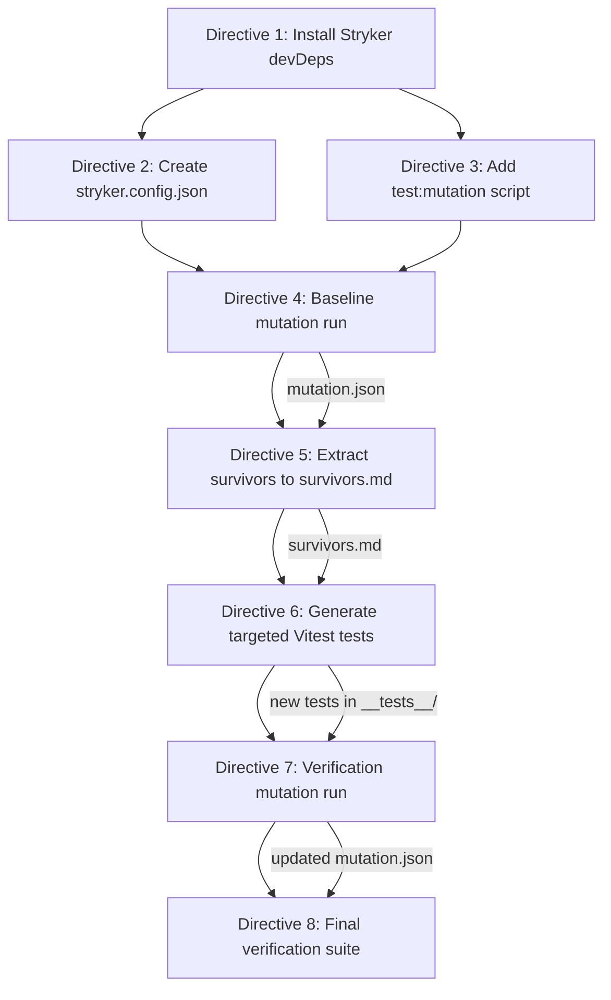

# Technical Specification

# 0. Agent Action Plan

## 0.1 Intent Clarification


### 0.1.1 Core Testing Objective

Based on the provided requirements, the Blitzy platform understands that the testing objective is to **establish a working Stryker mutation testing feedback loop** on the TypeScript/React frontend (`frontend/`) of the Weekend Planner AI Agent application. This is a Proof-of-Concept (PoC) implementation that executes one complete iteration of the mutation testing cycle: baseline capture → surviving mutant extraction → targeted Vitest test generation → verification re-run demonstrating score improvement.

**Request Category:** Add new tests (mutation-testing-driven targeted test generation)

The directive decomposes into eight sequential critical directives:

- **Directive 1 — Dependency Installation:** Install `@stryker-mutator/core` and `@stryker-mutator/vitest-runner` as devDependencies in `frontend/`
- **Directive 2 — Configuration Creation:** Create `frontend/stryker.config.json` with Vitest runner integration, scoped `mutate` array, multi-format reporters (HTML, JSON, clear-text, progress), PoC-appropriate thresholds, and `perTest` coverage analysis
- **Directive 3 — Script Registration:** Add a `"test:mutation"` npm script to `frontend/package.json` invoking `stryker run`
- **Directive 4 — Baseline Execution:** Execute the initial mutation run, record total mutants, killed/survived/no-coverage/timeout counts, and the baseline mutation score percentage; confirm `reports/mutation/mutation.json` is written
- **Directive 5 — Survivor Extraction:** Parse `mutation.json`, extract every mutant with `status === "Survived"`, and write structured entries to `frontend/reports/mutation/survivors.md` with all five required fields (file path, line/column, mutator name, original snippet, mutated snippet)
- **Directive 6 — Targeted Test Generation:** For each survivor entry, create a Vitest test in the corresponding `frontend/src/__tests__/` file that exercises the mutated line, includes an assertion that distinguishes original from mutated code, and embeds the mutator name and line number in the test description
- **Directive 7 — Verification Run:** Re-run mutation testing, confirm the score is strictly greater than the Directive 4 baseline, at least one previously surviving mutant is now killed, and updated `mutation.json` is written
- **Directive 8 — Final Verification Suite:** Execute all pass/fail criteria from Directives 1–7 and report consolidated results

**Implicit Testing Needs Surfaced:**

- The existing `client.test.ts` has 9 failing tests (MSW "Cannot bypass" errors in the sandboxed environment) which will cause Stryker's initial dry run to fail unless addressed — the test suite must be fully green before mutation testing can begin
- `App.tsx` (262 lines) currently has **zero test coverage** and no dedicated test file, yet it contains significant conditional rendering logic (state management, callback dispatch, render-priority branching) — mutants in this file will overwhelmingly survive, requiring a new `App.test.tsx`
- `src/types.ts` (310 lines) contains only TypeScript interfaces/types with no runtime logic — Stryker will generate zero meaningful mutants from this file
- The E2E smoke test (`e2e/smoke.spec.tsx`) is outside the Stryker mutation scope and has pre-existing failures unrelated to this effort

### 0.1.2 Special Instructions and Constraints

**User-Specified Directives:**

- The scope is constrained to `frontend/` — no backend (`WeekendPlanner/`) or documentation (`blitzy/`) changes
- The PoC requires exactly one full iteration of the feedback loop — not ongoing CI integration
- The JSON reporter is **required** for machine-readable survivor extraction (Directive 5 depends on `reports/mutation/mutation.json`)
- Thresholds are set for PoC: `{ "high": 80, "low": 60, "break": null }` — no hard failure floor
- The `~80 LoC delta` and `2 new files | 3 files modified` constraints from the user's summary guide scope sizing
- All survivor entries in `survivors.md` must contain all five required fields — no partial entries
- Directive 6 mandates coverage of ALL survivors — no cherry-picking

**Testing Pattern Requirements:**

- New tests must follow existing Vitest + React Testing Library patterns found in `src/__tests__/components/`
- MSW mock handlers from `src/__mocks__/handlers.ts` should be used for network-level mocking
- Test descriptions must include mutator name and line number for traceability (e.g., `"[ArithmeticOperator L42] verifies correct calculation"`)
- Each targeted test must pass for original code and would fail for mutated code

**User Example (Directive 5 survivors.md entry format):**
```
User Example: Each survivors.md entry MUST contain:
  - Relative file path (from frontend/src/)
  - Line and column numbers
  - Mutator name (e.g., ArithmeticOperator, ConditionalExpression, StringLiteral)
  - Original code snippet
  - Mutated code snippet
```

### 0.1.3 Technical Interpretation

These testing requirements translate to the following technical test implementation strategy:

- To **install Stryker tooling**, we will execute `npm install --save-dev @stryker-mutator/core @stryker-mutator/vitest-runner` inside `frontend/` and verify entries appear in `devDependencies` and `node_modules/@stryker-mutator/`
- To **configure mutation testing**, we will create `frontend/stryker.config.json` targeting the Vitest runner with scoped `mutate` patterns that align with the existing `vitest.config.ts` coverage exclusions
- To **enable script execution**, we will add `"test:mutation": "stryker run"` to `frontend/package.json` scripts
- To **capture the baseline**, we will run `npm run test:mutation` and parse the JSON output for aggregate statistics
- To **extract survivors**, we will parse `reports/mutation/mutation.json` programmatically and generate a structured Markdown report at `reports/mutation/survivors.md`
- To **generate targeted tests**, we will create or extend test files in `src/__tests__/` with assertions that exercise mutated lines — each test will be placed in the file corresponding to the source module where the mutant originated
- To **verify improvement**, we will re-run mutation testing and confirm the score delta is positive

### 0.1.4 Coverage Requirements Interpretation

- **Explicit targets:** The user specifies Stryker thresholds of `high: 80`, `low: 60`, `break: null` — the PoC does not enforce a hard floor but uses these as quality guidance
- **Implicit expectations:** Based on the existing Vitest coverage thresholds (lines: 80%, branches: 75%, functions: 80%, statements: 80% per `vitest.config.ts`) and industry standards for mutation testing, a meaningful PoC should demonstrate a measurable score increase (even a few percentage points validates the loop)
- **Current gap analysis:** Component tests achieve 96.26% statement coverage on `src/components/` but `App.tsx` (0%) and `client.ts` (0% from component tests alone) represent major mutation survival zones
- To achieve comprehensive testing, coverage should include: targeted assertions for conditional branches in `App.tsx` state transitions, error-handling paths in `client.ts` (SSE parsing, timeout logic, HTTP error mapping), validation boundary conditions in `InputForm.tsx`, and text-parsing edge cases in `PlanView.tsx`


## 0.2 Test Discovery and Analysis


### 0.2.1 Existing Test Infrastructure Assessment

Repository analysis reveals a **Vitest-based testing setup** with React Testing Library, MSW network mocking, and V8 coverage — a mature foundation for layering Stryker mutation testing on top.

**Comprehensive search conducted across the repository:**

- Test files identified via pattern matching: `src/__tests__/components/*.test.tsx` (5 files), `src/__tests__/api/*.test.ts` (1 file), `e2e/smoke.spec.tsx` (1 file)
- Testing framework detected from `frontend/package.json`: Vitest ^1.6.0 with `@vitest/coverage-v8 ^1.6.0`
- Test configuration located at `frontend/vitest.config.ts`: defines jsdom environment, globals enabled, setup file, V8 coverage provider with threshold enforcement
- Mock infrastructure identified at `frontend/src/__mocks__/handlers.ts`: MSW v2 handlers with success/error/delay/timeout factories, `formatAsSSE()` helper, and pre-configured server instance
- Test bootstrapping found at `frontend/src/__tests__/setup.ts`: imports `@testing-library/jest-dom`, manages MSW server lifecycle (`beforeAll`/`afterEach`/`afterAll`), polyfills `matchMedia`, `ResizeObserver`, `IntersectionObserver`

**Current Test Inventory:**

| Test File | Tests | Status | Coverage Focus |
|-----------|-------|--------|----------------|
| `src/__tests__/components/ErrorDisplay.test.tsx` | 37 | All pass | Error type mapping, retry, technical details, accessibility |
| `src/__tests__/components/InputForm.test.tsx` | 18 | All pass | Form validation, submission, reset, age parsing, accessibility |
| `src/__tests__/components/LoadingState.test.tsx` | 3 | All pass | Skeleton elements, accessibility attributes |
| `src/__tests__/components/PlanView.test.tsx` | 9 | All pass | Structured/unstructured rendering, RawOutput integration |
| `src/__tests__/components/RawOutput.test.tsx` | 4 | All pass | Accordion toggle, JSON display |
| `src/__tests__/api/client.test.ts` | 10 | 1 pass / 9 fail | Session creation, plan generation, SSE parsing |
| `e2e/smoke.spec.tsx` | 32 | 12 pass / 20 fail | Full user journey, form interaction, error recovery |

**Test Infrastructure Details:**

- **Current testing framework:** Vitest version ^1.6.0 (pinned via `package.json`)
- **Test runner configuration location:** `frontend/vitest.config.ts`
- **Coverage tools in use:** `@vitest/coverage-v8 ^1.6.0` with V8 provider, thresholds enforced at lines: 80%, branches: 75%, functions: 80%, statements: 80%
- **Mock/stub libraries detected:** MSW ^2.2.0 (network-level interception), `@testing-library/user-event ^14.5.0` (user interaction simulation)
- **Test data fixtures present:** Centralized in `src/__mocks__/handlers.ts` — includes `SAMPLE_PLAN_TEXT`, `mockPlanResponse` (3-event ADK response), factory functions: `create400Handler`, `create500Handler`, `createSessionFailureHandler`, `createDelayedHandler`, `createTimeoutHandler`, `createMalformedJsonHandler`, `createNetworkErrorHandler`
- **Browser API polyfills:** `matchMedia`, `ResizeObserver`, `IntersectionObserver` mocked in `setup.ts` for jsdom compatibility

**Critical Finding — Pre-existing Test Failures:**

The `client.test.ts` file has 9 failing tests caused by MSW `"Cannot bypass a request"` errors in the sandboxed environment. Stryker requires a fully green initial test run (dry run) to establish the baseline. These failures must be resolved or the failing tests excluded from Stryker's test execution before Directive 4 can succeed.

### 0.2.2 Web Search Research Conducted

- **Stryker + Vitest compatibility:** Confirmed that `@stryker-mutator/vitest-runner` (latest v9.1.1) supports Vitest ^1.x through the current v4.x. The `testRunner` config value must be `"vitest"` (not `"@stryker-mutator/vitest-runner"` as stated in the user directive — this is a critical correction)
- **Vitest runner coverage analysis:** The Vitest runner plugin always forces `"perTest"` coverage analysis regardless of the `coverageAnalysis` config setting — including the property is harmless but technically ignored
- **HTML reporter configuration:** `htmlReporter.baseDir` is deprecated in modern Stryker versions; `htmlReporter.fileName` should be used instead to specify the output path (e.g., `"reports/mutation/html/index.html"`)
- **JSON reporter defaults:** `jsonReporter.fileName` defaults to `"reports/mutation/mutation.json"` — aligns with the user's Directive 5 expectation
- **Known Vitest runner limitations:** Only `threads: true` is supported; Browser Mode is not supported; Vitest fixtures (custom `test` extensions) may cause issues — none of these apply to this project's standard test patterns
- **Stryker mutator categories for TypeScript/React:** Common mutators include `ArithmeticOperator`, `ConditionalExpression`, `StringLiteral`, `BlockStatement`, `BooleanLiteral`, `EqualityOperator`, `LogicalOperator`, `ArrayDeclaration`, `ObjectLiteral`, `UnaryOperator`, `OptionalChaining`


## 0.3 Testing Scope Analysis


### 0.3.1 Test Target Identification

**Primary code to be tested (mutation targets):**

- **Module:** `App` at `src/App.tsx` (262 lines) — requires targeted mutant-killing tests for state management (`isLoading`, `error`, `result`, `lastInput`), callback dispatch (`handleSubmit`, `handleReset`, `handleRetry`), and conditional render-priority logic (loading → error → success → idle)
- **Module:** `client` at `src/api/client.ts` (382 lines) — requires targeted tests for `createSession()`, `buildPrompt()`, `parseSSEResponse()`, `extractPlanText()` (SummarizerAgent prioritization), `generatePlan()` (two-step session + SSE flow), and `getErrorMessage()` error classification
- **Module:** `InputForm` at `src/components/InputForm.tsx` (337 lines) — requires targeted tests for `parseKidsAges()` boundary conditions (comma parsing, integer validation 1–119 range), validation state transitions, and controlled input edge cases
- **Module:** `PlanView` at `src/components/PlanView.tsx` (408 lines) — requires targeted tests for `parsePlanStructure()` regex matching (bullets, numbered items, headers, disclaimers), structured vs. unstructured fallback rendering, and empty-state handling
- **Module:** `ErrorDisplay` at `src/components/ErrorDisplay.tsx` (250 lines) — requires targeted tests for `getUserMessage()` error-type/status-code/message-pattern mapping, expandable details toggle, and conditional retry button rendering
- **Module:** `RawOutput` at `src/components/RawOutput.tsx` (132 lines) — requires targeted tests for collapsible toggle state and JSON serialization edge cases
- **Module:** `LoadingState` at `src/components/LoadingState.tsx` (106 lines) — requires targeted tests for skeleton animation elements and accessibility attributes
- **Module (excluded):** `types` at `src/types.ts` (310 lines) — contains only TypeScript interfaces with no runtime logic; zero mutants expected

**Existing test file mapping:**

| Source File | Existing Test File | Test Count | Statement Coverage |
|-------------|-------------------|------------|-------------------|
| `src/App.tsx` | **None** | 0 | 0% |
| `src/api/client.ts` | `src/__tests__/api/client.test.ts` | 10 (9 failing) | 0% (from component tests) |
| `src/components/InputForm.tsx` | `src/__tests__/components/InputForm.test.tsx` | 18 | 94.95% |
| `src/components/PlanView.tsx` | `src/__tests__/components/PlanView.test.tsx` | 9 | 92.89% |
| `src/components/ErrorDisplay.tsx` | `src/__tests__/components/ErrorDisplay.test.tsx` | 37 | 100% |
| `src/components/RawOutput.tsx` | `src/__tests__/components/RawOutput.test.tsx` | 4 | 100% |
| `src/components/LoadingState.tsx` | `src/__tests__/components/LoadingState.test.tsx` | 3 | 100% |

**Dependencies requiring mocking:**

- **External services to mock:** ADK backend API (`/apps/{app}/users/{user}/sessions` and `/run_sse` endpoints) — already handled by MSW handlers in `src/__mocks__/handlers.ts`
- **Network interactions to stub:** SSE (Server-Sent Events) streaming responses for plan generation — `formatAsSSE()` helper and `mockPlanResponse` fixture already exist
- **Browser APIs to virtualize:** `matchMedia`, `ResizeObserver`, `IntersectionObserver` — already polyfilled in `src/__tests__/setup.ts` for jsdom

### 0.3.2 Version Compatibility Research

Based on the current project stack (Node.js 20.x, TypeScript ^5.3.0, Vitest ^1.6.0, React 18.2.0), the recommended testing stack for Stryker integration:

| Tool | Package | Recommended Version | Rationale |
|------|---------|-------------------|-----------|
| Mutation framework | `@stryker-mutator/core` | ^9.1.0 | Latest stable series; supports ESM modules, Node 20.x, and all TypeScript mutators |
| Vitest runner | `@stryker-mutator/vitest-runner` | ^9.1.0 | Must match `@stryker-mutator/core` major version; supports Vitest ^1.x through ^4.x |
| Test runner | `vitest` | ^1.6.0 (existing) | Already installed; fully compatible with Stryker vitest runner |
| Coverage tool | `@vitest/coverage-v8` | ^1.6.0 (existing) | Already installed; Stryker uses its own instrumentation but existing coverage config is referenced |
| Assertion library | `@testing-library/jest-dom` | ^6.4.0 (existing) | Already installed; provides DOM-specific matchers used across all test files |
| Component testing | `@testing-library/react` | ^14.2.0 (existing) | Already installed; render/screen/waitFor utilities for React component testing |
| Network mocking | `msw` | ^2.2.0 (existing) | Already installed; network-level interception compatible with Stryker's mutation approach |

**Version Conflict Notes:**

- `@stryker-mutator/core` and `@stryker-mutator/vitest-runner` must share the same major version (both ^9.x)
- The project uses `"type": "module"` (ESM) — Stryker ^7.0+ fully supports ESM configurations
- No conflicts detected between Stryker packages and existing devDependencies
- The `testRunner` config value must be `"vitest"` (not the full package name `"@stryker-mutator/vitest-runner"`)


## 0.4 Test Implementation Design


### 0.4.1 Test Strategy Selection

This effort implements a **mutation-testing-driven test generation** strategy, where surviving mutants from a Stryker baseline run directly dictate which tests are authored. The strategy spans the following test types:

- **Unit tests:** Focus on isolated functions with high mutation potential — `parseKidsAges()`, `parsePlanStructure()`, `getUserMessage()`, `buildPrompt()`, `parseSSEResponse()`, `extractPlanText()`, `getErrorMessage()`
- **Integration tests:** Cover component-level state interactions in `App.tsx` — verifying that `handleSubmit`/`handleReset`/`handleRetry` callbacks correctly transition between loading, error, and success states
- **Edge case tests:** Address boundary conditions surfaced by mutant analysis — numeric boundary comparisons in age validation (1 vs. 0, 119 vs. 120), empty string handling in prompt building, null/undefined checks in SSE event parsing
- **Error handling tests:** Verify failure scenarios including HTTP error classification in `getErrorMessage()`, timeout handling in `generatePlan()`, malformed JSON in `parseSSEResponse()`, and conditional error-type rendering in `ErrorDisplay`

### 0.4.2 Test Case Blueprint

```
Component: App (src/App.tsx)
Test Categories:
- Happy path: Form submission triggers loading state, successful response renders PlanView
- Edge cases: Empty result handling, rapid sequential submissions, reset during loading
- Error cases: API failure sets error state with retry capability, network timeout display
- State transitions: Loading→Success, Loading→Error, Error→Retry→Loading, Success→Reset→Idle
```

```
Component: client (src/api/client.ts)
Test Categories:
- Happy path: createSession returns session ID, generatePlan returns structured result
- Edge cases: SSE response with no SummarizerAgent events, empty event arrays, partial JSON
- Error cases: HTTP 400/404/500 responses, timeout expiry, network disconnect, malformed SSE
- Function isolation: buildPrompt with/without optional fields, extractPlanText priority logic
```

```
Component: InputForm (src/components/InputForm.tsx)
Test Categories:
- Happy path: Valid zip + ages submission, zip-only submission
- Edge cases: Age boundary values (1, 119), mixed whitespace in comma-separated ages
- Error cases: Age 0, age 120, non-numeric input, empty location after trim
- Validation: parseKidsAges with edge inputs ("0", "120", "abc", "", "1,2,3")
```

```
Component: PlanView (src/components/PlanView.tsx)
Test Categories:
- Happy path: Bullet list parsing, numbered list parsing, header detection
- Edge cases: Mixed content types, single-line plan, very long text
- Error cases: Empty plan text, null data, plan with only disclaimers
- Parser isolation: parsePlanStructure regex matching for each line type
```

```
Component: ErrorDisplay (src/components/ErrorDisplay.tsx)
Test Categories:
- Happy path: Known error type renders correct user message
- Edge cases: Unknown error type fallback, error with no message property
- Error cases: Missing onRetry callback hides retry button
- Mapping isolation: getUserMessage for each error-type/status-code/pattern combination
```

```
Component: RawOutput (src/components/RawOutput.tsx)
Test Categories:
- Happy path: JSON data renders in pre block when expanded
- Edge cases: Deeply nested objects, arrays, null values in JSON
- Error cases: Non-serializable data handling
```

```
Component: LoadingState (src/components/LoadingState.tsx)
Test Categories:
- Happy path: Renders 4 skeleton cards with pulse animation
- Edge cases: Accessibility attributes (aria-busy, role="status")
```

### 0.4.3 Existing Test Extension Strategy

- **Tests to extend:** Enhance `InputForm.test.tsx` by adding mutant-specific assertions for `parseKidsAges()` boundary return values — current tests verify form-level behavior but not all arithmetic/comparison mutants in the parsing function
- **Tests to extend:** Enhance `PlanView.test.tsx` by adding assertions for individual regex branches in `parsePlanStructure()` — current tests verify rendered output but not all conditional paths in the parser
- **Tests to extend:** Enhance `ErrorDisplay.test.tsx` with tighter assertions on `getUserMessage()` return values for specific status code thresholds — current tests are comprehensive but may miss comparison-operator mutants
- **Tests to fix:** Resolve `client.test.ts` MSW failures before Stryker baseline — the 9 failing tests produce `"Cannot bypass a request"` errors that will prevent Stryker's dry run from succeeding
- **Tests to create:** Author `App.test.tsx` — no test file exists for the root component which contains substantial state-management and conditional-rendering logic

### 0.4.4 Test Data and Fixtures Design

**Required test data structures:**

- ADK event fixtures for `client.ts` testing — reuse existing `mockPlanResponse` and extend with edge-case variants (empty events, missing `content.parts`, null `author`)
- Form input fixtures for `InputForm.tsx` — structured objects matching `GeneratePlanInput` interface with boundary values
- Plan text fixtures for `PlanView.tsx` — sample strings with each line-type variant (bullet, numbered, header, disclaimer, plain text)
- Error fixtures for `ErrorDisplay.tsx` — `PlanError` objects covering all error type classifications

**Fixture organization strategy:**

- Leverage existing `src/__mocks__/handlers.ts` for all network-level fixtures — factory functions already cover success, 400, 500, session failure, delay, timeout, malformed JSON, and network error scenarios
- Inline test-specific fixtures within individual test files for component-level data — this follows the existing pattern observed in `InputForm.test.tsx` and `ErrorDisplay.test.tsx`

**Mock object specifications:**

- MSW handlers remain the primary mocking mechanism — Stryker operates at the source-code instrumentation level and does not interfere with MSW's network interception
- React Testing Library `render()` with custom props provides component-level test isolation — no additional mocking frameworks needed

**Test state management approach:**

- Each test uses fresh `render()` calls with isolated props — no shared mutable state between tests
- MSW server is reset via `afterEach(() => server.resetHandlers())` in `setup.ts` — ensures handler isolation across mutation test runs
- Stryker runs each mutant in a sandboxed copy of the project — test isolation is inherently maintained


## 0.5 Test File Transformation Mapping


### 0.5.1 File-by-File Test Plan

The following table maps every file to be created, updated, or referenced as part of this mutation testing loop. Target files are listed first per directive requirements.

| Target Test File | Transformation | Source File/Test | Purpose/Changes |
|-----------------|----------------|------------------|-----------------|
| `frontend/stryker.config.json` | CREATE | N/A | Stryker configuration: Vitest runner, mutate scope, reporters (HTML + JSON + clear-text + progress), PoC thresholds, perTest coverage analysis, output paths to `reports/mutation/` |
| `frontend/reports/mutation/survivors.md` | CREATE | `frontend/reports/mutation/mutation.json` | Structured surviving-mutant feed parsed from JSON report; each entry contains file path, line/column, mutator name, original snippet, mutated snippet |
| `frontend/package.json` | UPDATE | `frontend/package.json` | Add `@stryker-mutator/core` and `@stryker-mutator/vitest-runner` to devDependencies; add `"test:mutation": "stryker run"` to scripts |
| `frontend/src/__tests__/components/App.test.tsx` | CREATE | `src/App.tsx` | New comprehensive test file for root component: state transitions (loading/error/success/idle), handleSubmit/handleReset/handleRetry callbacks, conditional render-priority logic, targeted mutant-killing assertions |
| `frontend/src/__tests__/api/client.test.ts` | UPDATE | `src/api/client.ts` | Fix 9 failing MSW tests; add targeted mutant-killing tests for `buildPrompt()`, `parseSSEResponse()`, `extractPlanText()` priority logic, `getErrorMessage()` classification, and `generatePlan()` error paths |
| `frontend/src/__tests__/components/InputForm.test.tsx` | UPDATE | `src/components/InputForm.tsx` | Add targeted tests for surviving mutants in `parseKidsAges()` boundary logic (comparison operators at age 1/119), validation state edge cases, and arithmetic mutants in form handling |
| `frontend/src/__tests__/components/PlanView.test.tsx` | UPDATE | `src/components/PlanView.tsx` | Add targeted tests for surviving mutants in `parsePlanStructure()` regex branches, conditional rendering paths, header/bullet/numbered-item detection, and empty-state fallback |
| `frontend/src/__tests__/components/ErrorDisplay.test.tsx` | UPDATE | `src/components/ErrorDisplay.tsx` | Add targeted tests for surviving mutants in `getUserMessage()` status-code comparisons, error-type string matching, and conditional retry-button rendering |
| `frontend/src/__tests__/components/RawOutput.test.tsx` | UPDATE | `src/components/RawOutput.tsx` | Add targeted tests for surviving mutants in toggle state logic, `aria-expanded` attribute toggling, and JSON.stringify output verification |
| `frontend/src/__tests__/components/LoadingState.test.tsx` | UPDATE | `src/components/LoadingState.tsx` | Add targeted tests for surviving mutants in skeleton card count, animation class assignments, and accessibility attribute values |
| `frontend/src/__tests__/components/InputForm.test.tsx` | REFERENCE | `frontend/src/__tests__/components/ErrorDisplay.test.tsx` | Use ErrorDisplay test patterns for consistent assertion style, accessibility testing approach, and rendering verification |
| `frontend/src/__mocks__/handlers.ts` | REFERENCE | N/A | Reference for MSW handler patterns, factory functions, SSE formatting — used as template for any new mock scenarios needed in App.test.tsx |
| `frontend/src/__tests__/setup.ts` | REFERENCE | N/A | Reference for global test setup: jest-dom matchers, MSW lifecycle, browser API polyfills — all new test files inherit this configuration |

### 0.5.2 New Test Files Detail

**`frontend/src/__tests__/components/App.test.tsx`** — Root component integration tests

- Test categories: state transition happy paths (idle→loading→success, idle→loading→error), reset flow (success→idle), retry flow (error→loading→success), conditional rendering priority
- Mock dependencies: MSW handlers for `/apps/*/users/*/sessions` and `/run_sse` endpoints (from `handlers.ts`), custom error handlers via factory functions
- Assertions focus: verifying correct component rendering based on state (`LoadingState` during loading, `ErrorDisplay` on error, `PlanView` on success, `InputForm` always visible), callback prop wiring, and state cleanup on reset

**`frontend/reports/mutation/survivors.md`** — Structured surviving-mutant feed

- Generated programmatically from `mutation.json` after Directive 4 baseline run
- Each entry structured with Markdown formatting containing all five required fields
- Entry count must exactly match the Survived count from the baseline mutation report

### 0.5.3 Test Files to Modify Detail

**`frontend/src/__tests__/api/client.test.ts`** — Fix failures + add mutant-killing tests

- Fix existing: Resolve 9 MSW `"Cannot bypass"` failures by ensuring all API endpoints used in tests are covered by MSW handlers or by adjusting the `onUnhandledRequest` strategy for specific test contexts
- New test methods: assertions targeting `buildPrompt()` string concatenation mutants, `extractPlanText()` author-priority comparison mutants, `getErrorMessage()` status-code threshold mutants, `REQUEST_TIMEOUT_MS` constant reference mutants
- Updated fixtures: extend MSW handlers with additional edge-case response variants as needed

**`frontend/src/__tests__/components/InputForm.test.tsx`** — Add boundary mutant killers

- New test methods: assertions targeting `parseKidsAges()` comparison-operator mutants (e.g., `age > 0` mutated to `age >= 0` or `age < 0`; `age < 120` mutated to `age <= 120`), empty-string-after-trim mutants, integer-parsing edge cases
- Assertions to add: exact return-value checks for parsed age arrays to catch arithmetic-operator and equality-operator mutants

**`frontend/src/__tests__/components/PlanView.test.tsx`** — Add parser-branch mutant killers

- New test methods: assertions targeting each `parsePlanStructure()` regex condition — bullet detection (`/^[•\-\*]\s/`), numbered-item detection (`/^\d+[\.\)]\s/`), header detection (`/^#{1,3}\s/`), disclaimer detection
- Assertions to add: structured vs. unstructured rendering path verification, individual `ActivityCard` content checks

**`frontend/src/__tests__/components/ErrorDisplay.test.tsx`** — Add mapping mutant killers

- New test methods: assertions targeting `getUserMessage()` for each status-code branch (400, 403, 404, 500, 502, 503), error-type string-match branches, and message-pattern matching
- Assertions to add: exact user-message text verification to catch string-literal mutants

**`frontend/src/__tests__/components/RawOutput.test.tsx`** — Add toggle mutant killers

- New test methods: assertions targeting boolean-literal mutants in `isOpen` state initialization, aria-expanded attribute value verification
- Assertions to add: pre-block visibility checks before and after toggle

**`frontend/src/__tests__/components/LoadingState.test.tsx`** — Add structural mutant killers

- New test methods: assertions targeting skeleton card count (exactly 4), CSS class name assertions for `animate-pulse`, ARIA attribute value assertions
- Assertions to add: element count verification, class-name matching

### 0.5.4 Test Configuration Updates

- **`frontend/stryker.config.json`** (CREATE): Full Stryker configuration with `testRunner: "vitest"`, scoped `mutate` array, reporter configuration, PoC thresholds, and output paths
- **`frontend/package.json`** (UPDATE): Add `"test:mutation": "stryker run"` to scripts section; add `@stryker-mutator/core` and `@stryker-mutator/vitest-runner` to devDependencies
- **`frontend/vitest.config.ts`** (REFERENCE ONLY — no changes): Existing config is compatible with Stryker; the vitest runner auto-discovers this file
- **`frontend/.gitignore`** (UPDATE if exists): Add `reports/mutation/` output directory to prevent committing generated mutation reports to version control

### 0.5.5 Cross-File Test Dependencies

- **Shared fixtures:** `src/__mocks__/handlers.ts` — all MSW handlers and factory functions used by `client.test.ts`, `App.test.tsx`, and `e2e/smoke.spec.tsx`; new `App.test.tsx` will import `server` and handler factories from this module
- **Mock objects:** MSW `server` instance exported from `handlers.ts` — used via `server.use()` to apply per-test handler overrides in both `client.test.ts` and the new `App.test.tsx`
- **Test utilities:** `@testing-library/react` provides shared `render`, `screen`, `waitFor`, `fireEvent`, `within` utilities; `@testing-library/user-event` provides `userEvent.setup()` for realistic interaction simulation
- **Global setup:** `src/__tests__/setup.ts` — all test files automatically inherit jest-dom matchers, MSW lifecycle management, and browser API polyfills via the `setupFiles` configuration in `vitest.config.ts`
- **Import updates:** The new `App.test.tsx` will import `App` from `../../App`, MSW handlers from `../../__mocks__/handlers`, and React Testing Library utilities from `@testing-library/react` — following the established import path pattern used by existing component tests


## 0.6 Dependency Inventory


### 0.6.1 Testing Dependencies

All packages relevant to this mutation testing exercise, with exact names and verified versions:

**New Dependencies to Install:**

| Registry | Package Name | Version | Purpose |
|----------|--------------|---------|---------|
| npm | `@stryker-mutator/core` | ^9.1.0 | Stryker mutation testing framework core — provides mutant generation, instrumentation, reporter pipeline, and CLI (`stryker run`) |
| npm | `@stryker-mutator/vitest-runner` | ^9.1.0 | Stryker plugin for Vitest test runner integration — enables Stryker to delegate test execution to the project's Vitest configuration |

**Existing Dependencies (already in `frontend/package.json` devDependencies):**

| Registry | Package Name | Version | Purpose |
|----------|--------------|---------|---------|
| npm | `vitest` | ^1.6.0 | Vite-native test runner — executes all unit and component tests; Stryker vitest-runner delegates to this |
| npm | `@vitest/coverage-v8` | ^1.6.0 | V8-based code coverage provider — existing coverage thresholds used as quality reference |
| npm | `@testing-library/react` | ^14.2.0 | React component rendering and query utilities — `render`, `screen`, `waitFor`, `fireEvent` |
| npm | `@testing-library/jest-dom` | ^6.4.0 | DOM-specific assertion matchers — `toBeInTheDocument`, `toHaveAttribute`, `toHaveClass` |
| npm | `@testing-library/user-event` | ^14.5.0 | Realistic user interaction simulation — `userEvent.setup().click()`, `.type()`, `.clear()` |
| npm | `msw` | ^2.2.0 | Mock Service Worker — network-level API mocking for ADK backend endpoints |
| npm | `jsdom` | ^24.0.0 | Browser DOM simulation — provides `window`, `document`, `HTMLElement` for component tests |
| npm | `typescript` | ^5.3.0 | TypeScript compiler — type checking and JSX transformation |
| npm | `vite` | ^5.4.0 | Build tool — Stryker sandboxes use the project's Vite configuration for module resolution |
| npm | `@vitejs/plugin-react` | ^4.2.0 | Vite React plugin — enables JSX/TSX transformation in test environments |

**Runtime Dependencies (unchanged, referenced by tests):**

| Registry | Package Name | Version | Purpose |
|----------|--------------|---------|---------|
| npm | `react` | 18.2.0 | React library — exact pin, component rendering engine |
| npm | `react-dom` | 18.2.0 | React DOM bindings — exact pin, `createRoot` for rendering |

### 0.6.2 Import Updates

**New `App.test.tsx` import requirements:**

- `import { render, screen, waitFor, fireEvent } from '@testing-library/react'`
- `import userEvent from '@testing-library/user-event'`
- `import App from '../../App'`
- `import { server } from '../../__mocks__/handlers'`
- `import { http, HttpResponse } from 'msw'` (for per-test handler overrides)

**Existing test file import updates (if needed for mutant-killing tests):**

- `src/__tests__/api/client.test.ts` — may need to import additional handler factories from `../../__mocks__/handlers` to resolve failing tests and add new coverage
- `src/__tests__/components/*.test.tsx` — import patterns remain unchanged; new test cases within existing files use the same imports already at the top of each file

**No import transformation rules needed** — the module structure is stable and no refactoring of source paths is part of this effort.


## 0.7 Coverage and Quality Targets


### 0.7.1 Coverage Metrics

**Current Vitest code coverage (component tests only, 71 passing tests):**

| Source File | Statements | Branches | Functions | Lines |
|-------------|-----------|----------|-----------|-------|
| `src/components/ErrorDisplay.tsx` | 100% | 97.56% | 100% | 100% |
| `src/components/InputForm.tsx` | 94.95% | 79.06% | 100% | 94.95% |
| `src/components/LoadingState.tsx` | 100% | 100% | 100% | 100% |
| `src/components/PlanView.tsx` | 92.89% | 77.27% | 100% | 92.89% |
| `src/components/RawOutput.tsx` | 100% | 100% | 100% | 100% |
| `src/App.tsx` | 0% | 0% | 0% | 0% |
| `src/api/client.ts` | 0% | 0% | 0% | 0% |
| **Overall** | **63.23%** | **84.17%** | **84.61%** | **63.23%** |

**Stryker mutation score targets (Directive 2 thresholds):**

- **High threshold:** 80% — score at or above this is considered excellent
- **Low threshold:** 60% — score below this triggers warnings
- **Break threshold:** `null` — no hard failure floor for PoC baseline

**Expected baseline mutation score:** Given that `App.tsx` (0% coverage) and `client.ts` (0% tested due to failures) together represent ~644 lines of business logic with zero mutation-killing tests, the baseline mutation score is expected to be **low** (estimated 30–50%). Files with high coverage (`ErrorDisplay`, `RawOutput`, `LoadingState`) will have higher kill rates, but the uncovered files will pull the aggregate score down significantly.

**Target coverage after Directive 6 test generation:**

- Mutation score must be **strictly greater** than the Directive 4 baseline (user requirement)
- At least one previously surviving mutant must be killed (user requirement)
- Realistic improvement target: 10–25 percentage point increase depending on the number of survivors addressed and the complexity of the mutations

**Coverage gaps to address:**

- `App.tsx`: Currently 0% — the most critical gap. State management logic (`handleSubmit`, `handleReset`, `handleRetry`) and conditional rendering (`renderOutputPanel`) are mutation-rich areas where many mutants will survive without dedicated tests
- `client.ts`: Currently 0% from passing tests — `parseSSEResponse()`, `extractPlanText()`, `buildPrompt()`, and `getErrorMessage()` contain dense conditional logic ideal for mutation testing
- `InputForm.tsx` branches: 79.06% — uncovered lines 130–131, 209–214, 253–260, 324 contain validation edge cases that will produce surviving mutants
- `PlanView.tsx` branches: 77.27% — uncovered lines 83–84, 89–90, 136–146, 150–152, 206–208, 213–215, 349–353 contain regex-branch conditions and fallback rendering paths

### 0.7.2 Test Quality Criteria

- **Assertion density:** Each mutant-killing test must contain at least one assertion that would fail for the mutated code — tests with only render-level assertions (e.g., `toBeInTheDocument`) may not catch arithmetic or comparison-operator mutants
- **Test isolation:** Every test must be independently runnable; no shared mutable state between tests; MSW handlers reset after each test via the global `setup.ts` lifecycle
- **Performance constraints:** Stryker mutation runs may take several minutes for this project (~2,187 lines across 7 mutable files); individual test execution must remain fast (existing tests run in ~2.5 seconds total)
- **Maintainability standards:** Test descriptions must include mutator name and line number (per Directive 6) for traceability; each test should clearly document which mutant it targets
- **Repository pattern compliance:** New tests must follow the existing conventions: React Testing Library for rendering/querying, `userEvent` for interactions, `jest-dom` matchers for assertions, MSW for network mocking, descriptive `describe`/`it` nesting


## 0.8 Scope Boundaries


### 0.8.1 Exhaustively In Scope

**New files:**

- `frontend/stryker.config.json` — Stryker mutation testing configuration
- `frontend/reports/mutation/survivors.md` — Structured surviving-mutant extraction feed
- `frontend/src/__tests__/components/App.test.tsx` — New root component test file for `App.tsx` mutant killing

**Test file updates (mutant-killing test additions):**

- `frontend/src/__tests__/api/client.test.ts` — Fix 9 failing tests + add targeted mutant killers
- `frontend/src/__tests__/components/InputForm.test.tsx` — Add boundary/comparison mutant killers
- `frontend/src/__tests__/components/PlanView.test.tsx` — Add parser-branch mutant killers
- `frontend/src/__tests__/components/ErrorDisplay.test.tsx` — Add error-mapping mutant killers
- `frontend/src/__tests__/components/RawOutput.test.tsx` — Add toggle-logic mutant killers
- `frontend/src/__tests__/components/LoadingState.test.tsx` — Add structural mutant killers

**Configuration updates:**

- `frontend/package.json` — Add Stryker devDependencies + `"test:mutation"` script

**Generated outputs (machine-produced, not hand-authored):**

- `frontend/reports/mutation/mutation.json` — Stryker JSON report (baseline and verification runs)
- `frontend/reports/mutation/mutation.html` — Stryker HTML report (baseline and verification runs)

**Test utilities and helpers (reference only, no modifications):**

- `frontend/src/__mocks__/handlers.ts` — MSW handler infrastructure
- `frontend/src/__tests__/setup.ts` — Global test setup

**Source files in Stryker mutate scope (read-only mutation targets):**

- `frontend/src/App.tsx`
- `frontend/src/api/client.ts`
- `frontend/src/components/InputForm.tsx`
- `frontend/src/components/PlanView.tsx`
- `frontend/src/components/ErrorDisplay.tsx`
- `frontend/src/components/RawOutput.tsx`
- `frontend/src/components/LoadingState.tsx`
- `frontend/src/types.ts` (included in scope but expected to produce zero mutants — pure type definitions)

### 0.8.2 Explicitly Out of Scope

- **Backend code:** `WeekendPlanner/` Python backend — no changes, no testing
- **Documentation directory:** `blitzy/` — no changes
- **E2E tests:** `frontend/e2e/smoke.spec.tsx` — pre-existing failures unrelated to this effort; not part of Stryker mutation scope
- **Source code modifications for testability:** No changes to production source files (`App.tsx`, `client.ts`, etc.) — tests must work against the existing source code as-is
- **CI/CD pipeline integration:** No `.github/` workflow files, no automated Stryker runs in CI — the PoC is a single manual iteration
- **Stryker incremental mode setup:** Not needed for a one-iteration PoC
- **Stryker TypeScript checker plugin:** Not included — type checking is not required for mutation testing and adds overhead
- **Feature additions:** No new application features while adding tests
- **Performance optimization:** No Stryker concurrency tuning beyond defaults
- **Root-level configuration files:** `requirements.txt`, `.env.example`, `README.md` — no changes
- **Styling or build changes:** `tailwind.config.js`, `postcss.config.js`, `vite.config.ts` — no changes
- **Stryker dashboard reporter:** Not configured — local HTML + JSON reports only for PoC


## 0.9 Execution Parameters


### 0.9.1 Testing-Specific Instructions

**Test execution commands:**

- **Run all unit/component tests:** `cd frontend && npx vitest run`
- **Run tests with coverage:** `cd frontend && npx vitest run --coverage`
- **Run specific test file:** `cd frontend && npx vitest run src/__tests__/components/App.test.tsx`
- **Run component tests only:** `cd frontend && npx vitest run src/__tests__/components/`
- **Run API tests only:** `cd frontend && npx vitest run src/__tests__/api/`

**Mutation testing commands:**

- **Baseline mutation run (Directive 4):** `cd frontend && npm run test:mutation`
- **Dry run validation (Directive 2):** `cd frontend && npx stryker run --dryRun`
- **Verification mutation run (Directive 7):** `cd frontend && npm run test:mutation`
- **Stryker version check:** `cd frontend && npm run test:mutation -- --version`

**Coverage measurement commands:**

- **Vitest V8 coverage:** `cd frontend && npx vitest run --coverage --reporter=verbose`
- **Stryker mutation report:** Review `frontend/reports/mutation/mutation.json` for machine-readable metrics and `frontend/reports/mutation/mutation.html` for visual inspection

**Debug mode execution:**

- **Stryker debug logging:** `cd frontend && npx stryker run --logLevel debug`
- **Stryker trace logging:** `cd frontend && npx stryker run --logLevel trace`
- **Vitest verbose mode:** `cd frontend && npx vitest run --reporter=verbose`

**Specific test patterns to follow in the repository:**

- Test files use the naming convention `*.test.tsx` for React components and `*.test.ts` for non-component modules
- Test files are organized into `src/__tests__/components/` for component tests and `src/__tests__/api/` for API module tests
- Each test file uses `describe`/`it` nesting with descriptive test names
- MSW handlers are imported from `src/__mocks__/handlers.ts` and applied via `server.use()` for per-test overrides
- React Testing Library `render()` is called per-test (not shared across tests) for isolation
- `userEvent.setup()` is used for user interaction simulation rather than `fireEvent` where possible
- `jest-dom` matchers (`toBeInTheDocument`, `toHaveAttribute`, `toHaveClass`, `toHaveTextContent`) are preferred for DOM assertions

**Environment setup requirements for tests:**

- Node.js 20.x (currently installed: v20.20.2)
- npm 11.x (currently installed: 11.1.0)
- All dependencies installed via `cd frontend && npm install`
- Stryker packages installed via `cd frontend && npm install --save-dev @stryker-mutator/core @stryker-mutator/vitest-runner`
- No environment variables required for test execution (API calls are intercepted by MSW)
- No running backend server needed (MSW mocks all network requests)


## 0.10 Special Instructions for Testing


### 0.10.1 Testing-Specific Requirements

The following directives are explicitly emphasized by the user and must be strictly observed:

**Minimal change principle:**

- ONLY create/modify test files, test configuration (`stryker.config.json`), and package metadata (`package.json` devDependencies/scripts)
- DO NOT modify source code (`App.tsx`, `client.ts`, component files) — tests must work against the existing source as-is
- DO NOT refactor, restructure, or reorganize existing test files beyond what is necessary to fix failures and add mutant-killing tests

**Stryker configuration corrections (technical divergences from user directive):**

- The user specifies `"testRunner": "@stryker-mutator/vitest-runner"` in Directive 2 — the correct value per Stryker documentation is `"testRunner": "vitest"`. Stryker auto-discovers the `@stryker-mutator/vitest-runner` package via its plugin system
- The user specifies `"coverageAnalysis": "perTest"` — while this can be included in the config, the Vitest runner plugin always forces `"perTest"` coverage analysis regardless of this setting; the property is effectively ignored
- The user specifies `"htmlReporter.baseDir"` — this property is deprecated in modern Stryker versions. The implementation should use `"htmlReporter": { "fileName": "reports/mutation/html/index.html" }` instead

**Directive execution order is strictly sequential:**

- Directive 1 (install) → Directive 2 (config) → Directive 3 (script) → Directive 4 (baseline) → Directive 5 (extract) → Directive 6 (generate tests) → Directive 7 (verify) → Directive 8 (final check)
- Each directive's pass/fail criteria must be confirmed before proceeding to the next

**Pre-existing test failure handling:**

- The 9 failing tests in `client.test.ts` (MSW `"Cannot bypass"` errors) must be resolved before Directive 4 — Stryker requires all tests to pass in the initial dry run
- The E2E test failures in `e2e/smoke.spec.tsx` are outside Stryker's scope but should not interfere since Stryker only runs tests matching `vitest.config.ts` patterns within its sandboxed environment

**Survivor extraction completeness:**

- `survivors.md` entry count MUST exactly match the Survived count from Directive 4
- Every entry MUST contain all five required fields — no partial entries, no placeholders
- All survivors from `mutation.json` must be processed — no cherry-picking or filtering

**Targeted test generation completeness:**

- One new test MUST exist per surviving mutant — no survivors can be skipped
- Each test description MUST reference the mutator name and line number for traceability
- Each test MUST pass for the original code AND would fail for the mutated code
- Tests are placed in the `src/__tests__/` file corresponding to the source module where the mutant originated

**Verification criteria (Directive 8 consolidated checklist):**

- `@stryker-mutator/core` and `@stryker-mutator/vitest-runner` present in `frontend/package.json` devDependencies
- `frontend/stryker.config.json` exists and `npx stryker run --dryRun` exits 0
- `"test:mutation"` script present in `frontend/package.json`
- Baseline mutation score documented with killed/survived/no-coverage/timeout breakdown
- `survivors.md` written with all five required fields per entry
- All targeted tests pass on `npm test`
- Verification mutation score is strictly greater than baseline with delta reported

### 0.10.2 Stryker Configuration Specification

The `frontend/stryker.config.json` must be created with the following exact structure:

```json
{
  "$schema": "./node_modules/@stryker-mutator/core/schema/stryker-schema.json",
  "testRunner": "vitest",
  "mutate": [
    "src/**/*.{ts,tsx}",
    "!src/__tests__/**",
    "!src/__mocks__/**",
    "!src/main.tsx",
    "!src/**/*.d.ts"
  ],
  "reporters": ["html", "json", "clear-text", "progress"],
  "thresholds": { "high": 80, "low": 60, "break": null },
  "coverageAnalysis": "perTest",
  "htmlReporter": {
    "fileName": "reports/mutation/html/index.html"
  },
  "jsonReporter": {
    "fileName": "reports/mutation/mutation.json"
  }
}
```

**Configuration rationale:**

- `"$schema"` — Enables editor autocompletion and validation
- `"testRunner": "vitest"` — Corrected from user directive; Stryker auto-discovers the vitest-runner plugin
- `"mutate"` array — Includes all TypeScript/TSX source files, explicitly excludes test files, mock files, entry point, and type declaration files — aligns with existing `vitest.config.ts` coverage exclusions
- `"reporters"` — JSON reporter is required by Directive 5 for machine-readable survivor extraction; HTML provides visual inspection; clear-text and progress provide terminal feedback
- `"thresholds"` — PoC-appropriate values with no hard failure floor (`break: null`)
- `"coverageAnalysis": "perTest"` — Included for documentation clarity though the vitest runner enforces this automatically
- `"htmlReporter.fileName"` — Uses modern API (not deprecated `baseDir`), outputs to `reports/mutation/` directory
- `"jsonReporter.fileName"` — Outputs to `reports/mutation/mutation.json` as required by Directive 5

### 0.10.3 Mutation Feedback Loop Workflow

The complete single-iteration PoC workflow follows this sequence:


```mermaid
graph TD
    A[Directive 1: Install Stryker devDeps] --> B[Directive 2: Create stryker.config.json]
    A --> C[Directive 3: Add test:mutation script]
    B --> D[Directive 4: Baseline mutation run]
    C --> D
    D --> E[Directive 5: Extract survivors to survivors.md]
    E --> F[Directive 6: Generate targeted Vitest tests]
    F --> G[Directive 7: Verification mutation run]
    G --> H[Directive 8: Final verification suite]
    
    D -->|mutation.json| E
    E -->|survivors.md| F
    F -->|new tests in __tests__/| G
    G -->|updated mutation.json| H
```

**Pass/fail gate at each directive ensures sequential correctness — no directive proceeds until its predecessor's criteria are confirmed.**


