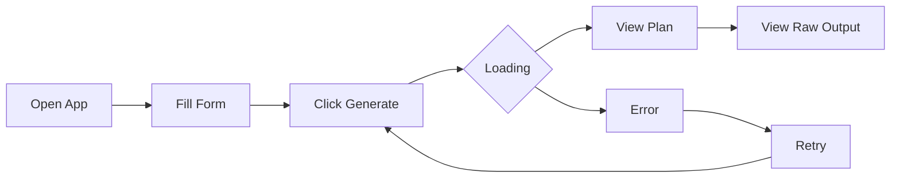

# User Guide

Welcome to the complete Weekend Planner User Guide! This guide will walk you through every feature of the application, helping you get the most out of your AI-powered weekend planning experience.

## What You'll Learn

In this guide, you'll discover:

- How to fill out the planning form with your family's details
- Understanding form validation and fixing any errors
- What happens when you generate a plan
- How to read and interpret your personalized recommendations
- Viewing additional details with the Raw Output feature
- How to handle errors and retry
- Tips for getting the best possible results

---

## Application Overview

The Weekend Planner follows a simple flow from entering your information to receiving personalized activity suggestions. Here's how the process works:

**Understanding the Flow:**

1. **Open App** - Start by opening the Weekend Planner in your web browser
2. **Fill Form** - Enter your location, dates, and optional preferences
3. **Click Generate** - Submit your information to create a plan
4. **Loading** - Wait while the AI researches activities for you
5. **View Plan** - Review your personalized weekend recommendations
6. **View Raw Output** - (Optional) See the detailed AI response
7. **Error/Retry** - If something goes wrong, you can easily try again

---

## The Input Form

The input form is where you tell Weekend Planner about your upcoming weekend. The form has five fields—three required and two optional.

### Location (Required)

Enter where you'll be spending your weekend. You can type:

- A city name (like "San Francisco" or "Austin, TX")
- A zip code (like "94102" or "78701")

The AI uses your location to find local activities, special events, and weather information for your area.

**Tip:** Be as specific as possible for better results. Including the state or zip code helps the AI find activities closer to you.

### Start Date (Required)

Select the date when your weekend begins. Click on the date field to open a date picker, then choose your start date.

This tells the AI when to look for weekend activities and check the weather forecast.

### End Date (Required)

Select the date when your weekend ends. This must be the same day as your start date or later.

**Important:** If you select an end date that's before your start date, you'll see an error message. Simply correct the date to continue.

### Kids Ages (Optional)

If you're planning for children, enter their ages separated by commas.

**Examples of valid entries:**
- "5, 10" (two children, ages 5 and 10)
- "3, 7, 12" (three children of different ages)
- "8" (one child, age 8)

When you provide children's ages, the AI tailors its recommendations to include age-appropriate activities. Activities for a 5-year-old differ from those suitable for a teenager!

**Tip:** You can include spaces after commas for readability—the form accepts both "3,7,12" and "3, 7, 12".

### Preferences (Optional)

Use this text box to describe what kind of activities your family enjoys. This helps the AI personalize your recommendations.

**Example preferences you might enter:**
- "outdoor activities, parks"
- "avoid crowds, quiet places"
- "educational activities, museums"
- "free activities, budget-friendly"
- "adventure, hiking, nature"

The more details you provide, the better your personalized plan will be.

---

## Form Validation

The Weekend Planner checks your entries to make sure everything is filled out correctly before generating your plan.

### Required Fields

Three fields must be completed before you can generate a plan:

- **Location** - Cannot be empty
- **Start Date** - Must select a valid date
- **End Date** - Must select a valid date

If any required field is missing, the "Generate Plan" button remains disabled and you won't be able to submit the form.

### Date Validation

The application ensures your dates make sense:

- **End date must be on or after start date** - You cannot plan a weekend that ends before it starts

If you select an end date that comes before your start date, you'll see an error message appear near the date fields explaining the issue.

### Fixing Validation Errors

When you see a validation error:

1. Look for the red error message near the problem field
2. Read the message—it explains what needs to be fixed
3. Update the field with a valid entry
4. The error message will disappear once the issue is resolved

**Screenshot Reference:** See `images/form-validation-error.png.txt` for an example of how validation errors appear.

---

## Generating Your Plan

Once your form is complete and valid, you're ready to create your personalized weekend plan.

### The Generate Plan Button

The "Generate Plan" button appears in coral color when it's ready to use. Here's how its state changes:

- **Disabled (grayed out)** - The form is incomplete or has errors
- **Enabled (coral colored)** - All required fields are valid and you can click to proceed

### What Happens When You Click Generate

1. **Form submission** - Your information is sent to the AI
2. **Loading begins** - The output area shows a loading animation
3. **AI research** - The system checks weather, searches for activities, and finds special events
4. **Results appear** - Your personalized plan replaces the loading animation

### The Loading State

While your plan is being created, you'll see:

- Animated skeleton cards that pulse gently
- A message saying "Creating your perfect weekend..."
- The form area may appear slightly dimmed

**Screenshot Reference:** See `images/loading-state.png.txt` for what the loading state looks like.

### How Long Does It Take?

Plan generation typically takes 10 to 30 seconds. The AI is:

- Checking weather forecasts for your area
- Searching for local activities near you
- Finding special events like festivals or community gatherings
- Compiling personalized recommendations based on your children's ages

If the process takes longer than 30 seconds, you may see a timeout error. Don't worry—you can simply try again.

---

## Understanding Your Results

When your plan is ready, you'll see a summary of recommended activities for your weekend.

### Reading Your Plan Summary

Your plan includes several key pieces of information:

**Header Information:**
- Your location and the dates of your weekend
- Current weather conditions or forecast
- The ages of children you're planning for (if provided)

**Activity Recommendations:**
- A bulleted list of 3-5 recommended activities
- Each suggestion includes the activity name and why it's a good fit
- The AI explains how weather and other factors influenced its choices

### Weather-Aware Recommendations

The AI is smart about weather! Your recommendations change based on the forecast:

- **Good weather** - Expect outdoor activities, parks, and events
- **Bad weather** - Mix of indoor and outdoor options
- **Severe weather** - Indoor activities, home-based suggestions, and backup plans

The plan always considers safety and comfort when making recommendations.

### Types of Activities You May See

Depending on the weather and your preferences, your plan might include:

**Outdoor Activities:**
- Parks and playgrounds
- Nature trails and hiking
- Outdoor festivals

**Indoor Activities:**
- Museums and science centers
- Indoor play areas
- Creative projects at home

**Special Events:**
- Community festivals
- Local fairs
- Concerts and performances
- Seasonal celebrations

### Important Disclaimer

At the bottom of your plan, you'll notice a disclaimer reminding you that:

- Results are AI-generated suggestions
- Activities should be verified for current availability
- Check with venues directly before making final plans

This ensures you always confirm details before heading out!

**Screenshot Reference:** See `images/plan-result.png.txt` for an example of a generated plan.

---

## Viewing Raw Output

For those curious about the detailed AI response, Weekend Planner includes a Raw Output feature.

### What is Raw Output?

The Raw Output shows the complete, unprocessed response from the AI system. This includes:

- Technical identifiers and timestamps
- The full text of all AI agent responses
- Information that gets summarized in your plan view

### How to View Raw Output

1. Generate a plan successfully
2. Look for the "Raw Output" section below your plan summary
3. Click the toggle or header to expand the section
4. The full response appears in a scrollable box

### Collapsing Raw Output

The Raw Output section is **collapsed by default** to keep the interface clean. You can:

- Click the toggle to expand it
- Click again to collapse it back
- The section remembers its state while you're on the page

### When Raw Output is Useful

You might want to view the Raw Output when:

- You're curious about how the AI arrived at its recommendations
- You want to see additional details not shown in the summary
- You're troubleshooting unexpected results
- You want to share the detailed response with someone

Most users won't need to view the Raw Output—the summarized plan contains all the essential information.

**Screenshot Reference:** See `images/plan-raw-output.png.txt` to see the expanded Raw Output section.

---

## Handling Errors

Sometimes things don't go as planned. Here's how to handle common errors.

### Common Error Messages

**"Couldn't reach the backend"**
- The AI server isn't running or isn't reachable
- Make sure the backend service is started before using the application

**"Request timed out"**
- The plan took too long to generate (over 30 seconds)
- The AI might be experiencing high demand
- Try again—it often works on the second attempt

**"Invalid request"**
- Something about your input wasn't accepted
- Double-check your form entries and try again

**"Something went wrong on the server"**
- A temporary issue on the AI side
- Wait a moment and retry your request

### How to Retry After an Error

When you see an error:

1. Read the error message to understand what happened
2. If there's a "Retry" or "Try Again" button, click it
3. Alternatively, make any suggested corrections and click "Generate Plan" again

### Viewing Technical Details

Error messages include an expandable "Technical Details" section. This shows:

- Error codes and status information
- The exact response received
- Information that may help if you need to seek additional help

Most errors can be resolved by simply trying again or checking that the backend is running.

**Screenshot Reference:** See `images/error-state.png.txt` to see how errors are displayed.

### When to Seek Help

If you've tried multiple times and still encounter errors:

1. Check that all services are running properly
2. Review the Troubleshooting guide for your specific error
3. If problems persist, report the issue through the appropriate channels

---

## Starting Over

Sometimes you want to start fresh or try different settings. Weekend Planner makes this easy.

### Using the Reset Button

The "Reset" button clears everything and returns the application to its initial state:

- All form fields are cleared
- Any generated plan is removed
- Validation errors are cleared
- The output area shows the initial empty state

This is useful when you want to plan for a completely different weekend or location.

### When to Regenerate vs. Reset

**Use "Generate Plan" again when:**
- You made a small change to your preferences
- You want to see different recommendations for the same trip
- The first result wasn't quite what you wanted

**Use "Reset" when:**
- You're planning for a different weekend entirely
- You want to change the location significantly
- You want to start with a completely clean slate

### Modifying Your Inputs

You don't always need to reset. You can:

1. Change any field in the form
2. Click "Generate Plan" again
3. Get new recommendations based on your updated inputs

The AI generates fresh results each time, even with the same inputs, so you might get different suggestions!

**Screenshot Reference:** See `images/regenerate-flow.png.txt` to see the reset and regenerate workflow.

---

## Tips for Best Results

Get the most out of Weekend Planner with these helpful tips.

### Be Specific with Location

The more specific your location, the better your results:

- **Good:** "San Francisco, CA" or "94102"
- **Better:** "Downtown San Francisco, CA"
- **Best:** Include a zip code for precise local results

Specific locations help the AI find activities that are actually near you, not just in your general region.

### Include Children's Ages

Even if you don't have specific ages, providing approximate ages helps enormously:

- A plan for toddlers (ages 2-4) differs from one for school-age kids (6-10)
- Teenage activities (13-17) are quite different from those for younger children
- Mixed ages? Include all of them, and the AI will find something for everyone

### Use Preferences to Customize

Don't skip the preferences field! It's your chance to tell the AI what matters most:

**For outdoor enthusiasts:**
"hiking, nature, parks, outdoor adventures"

**For budget-conscious families:**
"free activities, no-cost, budget-friendly"

**For educational focus:**
"museums, learning activities, science centers, educational"

**For relaxed weekends:**
"low-key, relaxed pace, avoid crowds"

### Try Multiple Times

The AI searches real-time information, so results can vary:

- Run the same query twice to see different options
- Seasonal events and activities change frequently
- Weather forecasts update and may affect recommendations

### Plan Ahead

For the best results:

- Enter dates at least a few days in advance
- This gives you time to verify and book activities
- Last-minute plans work too, but you'll have less flexibility

### Verify Before You Go

Always remember to:

- Check activity hours and availability
- Confirm event dates haven't changed
- Look up current pricing and reservation requirements
- Have a backup plan in case something falls through

The AI provides great suggestions, but real-world details can change!

---

## Conclusion

You're now ready to make the most of Weekend Planner! Remember:

1. **Fill out the form** with your location, dates, and preferences
2. **Click Generate** and wait for your personalized plan
3. **Review your results** and explore the suggestions
4. **Use Reset** when you want to start fresh
5. **Check the Raw Output** if you want more details

Have a wonderful weekend with your family!

---

**Need more help?**
- [Getting Started Guide](getting-started.md) - Quick introduction for first-time users
- [Troubleshooting](troubleshooting.md) - Solutions to common problems
- [Documentation Index](README.md) - Return to documentation home
